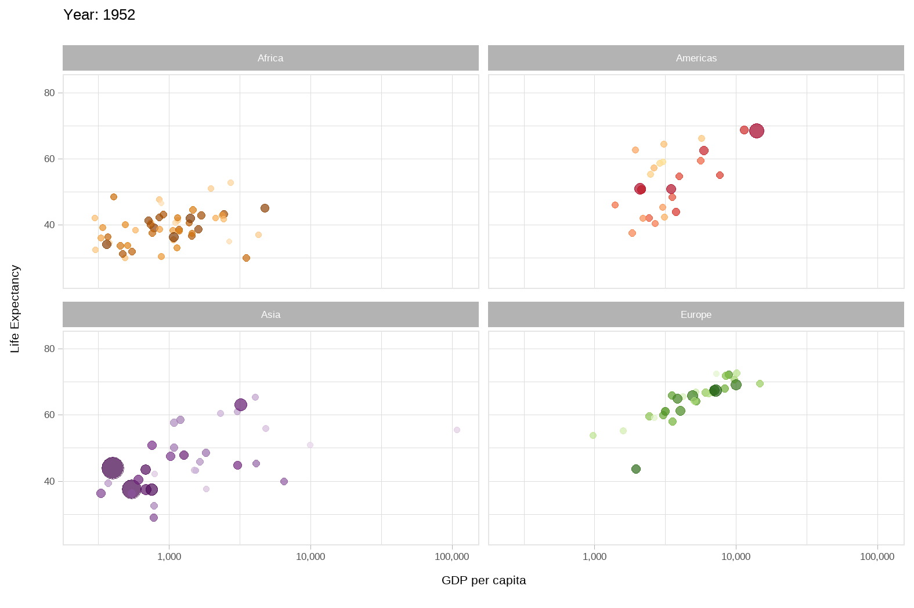

```{css, echo=FALSE}
# CSS for including pauses in printed PDF output (see bottom of lecture)
@media print {
  .has-continuation {
    display: block !important;
  }
}
.remark-code-line {
  font-size: 95%;
}
.small {
  font-size: 75%;
}
.scroll-output-full {
  height: 90%;
  overflow-y: scroll;
}
.scroll-output-75 {
  height: 75%;
  overflow-y: scroll;
}
```

```{r setup, include=FALSE}
options(htmltools.dir.version = FALSE)
library(knitr)
library(fontawesome)
knitr::opts_chunk$set(
	fig.align = "center",
	cache = FALSE,
	dpi = 300,
  warning = F,
  message = F,
	fig.height = 5,
	out.width = "80%"
)
```

# Table of Contents


1. [Prologue](#prologue)

2. [Principles of Data Visualization](#datavis)

3. [Getting Started with ggplot2](#ggplot2)

4. [Other Common Charts](#charts)

5. [Exporting Charts](#export)

6. [Colors and Themes](#themes)

7. [Extending ggplot2](#extend)


---
class: inverse, middle
name: prologue

# Prologue

---

# Prologue

Packages we'll use for today's examples:
  
```{r}
pacman::p_load(dslabs, gapminder, lubridate, tidyverse)
```

Additional packages if you want to replicate the plots in the "Principles of Data Visualization" section:

```{r}
pacman::p_load(ggrepel, readxl, scales)
```


---

# Prologue

Additional packages if you want to replicate the color schemes later on:

```{r}
pacman::p_load(RColorBrewer, viridis, Polychrome, broman)
```

and to replicate the theme/plot extensions:

```{r}
pacman::p_load(ggthemes, showtext, gganimate, gifski, ggExtra)
```

---

# Data Visualization

Being able to .hi-medgrn[visualize data well] is a critical skill for economists and data scientists.

  * Effectively communicate a message
  * Engage a reader/audience
  * Discover patterns in the underlying data


--

To do this in R, we're going to use the incredibly powerful .hi-slate[ggplot2] package, but before we do, let's chat about...

---
class: inverse, middle
name: datavis

# Principles of Data Visualization

---

# Principles of Data Visualization

We're going to focus on the .hi-medgrn[punchline] of the principles of data visualization today.

If you want more of the .hi-blue[setup], there are excellent resources available:

  * [Introduction to Data Science](http://rafalab.dfci.harvard.edu/dsbook/r-basics.html)   by Rafael A. Irizarry
  * [Data Visualization a Practical Introduction](https://socviz.co/)  by Kieran Healy
  * ["Creating Effective Figures and Tables" talk](https://github.com/kbroman/Talk_Graphs?tab=readme-ov-file)  by Karl Broman
  * [An Economist's Guide to Visualizing Data](https://www.aeaweb.org/articles?id=10.1257/jep.28.1.209)  by Jonathan A. Schwabish (JPE 2014)
  * [Modern Data Science with R, 2nd Ed.](https://mdsr-book.github.io/mdsr2e/ch-vizI.html)  by Baumer, Kaplan, and Horton
  * [from Data to Viz (finding the appropriate graph)](https://www.data-to-viz.com/) 
  * [R Graph Gallery](https://r-graph-gallery.com/)

---

# Effective Charts

An .hi-medgrn[effective graph or chart]
  * Conveys information clearly
  * Summarizes data quickly
  * Helps identify salient features or patterns
  * Conveys complex relationships in easy-to-communicate visuals

---

# Effective Charts
.center[

]
---

# Poorly Constructed Charts

On the other hand, .hi-blue[poorly constructed charts]
  * Unintentionally obscure or purposefully misreport true relationships
  * Convey too much information without the necessary orienting information easily accessible
  * Are completely uninterpretable
---

# Imperfect Charts
.center[

]


.footnote[Source: [Wall Street Journal, 2/11/2015](http://graphics.wsj.com/infectious-diseases-and-vaccines/).]


---

# Dishonest Charts
.center[

]


.footnote[Source: [McGarry, 8/15/2016 (Mashable)](https://mashable.com/article/zika-graph-gets-it-wrong/).]

---

# Principles of Data Visualization

When constructing charts, we need to keep in mind several .hi-slate[key principles:]

<br>

.hi-blue[1\. Show the Data]

--

.hi-medgrn[2\. Reduce the Clutter]

--

.hi-red[3\. Integrate the Text and the Graph]

---
# Show the Data

We use graphs to help readers/listeners understand a story. The data are the .hi-blue[most important part] of this.
  * Present the data in the .hi-medgrn[clearest way possible]
  * However, that doesn't mean we have to show .hi-purple[all the data]

---
# Show the Data

```{r, echo = F, out.width = "95%"}
# read in the co2 emissions data
co2 <- read_csv("data/annual-co2-emissions-per-country.csv",
         col_names = c("country", "code", "year", "emissions")) %>%
  filter(year == 2022,
         country %in% c("Azerbaijan", "Bulgaria", "Croatia",  "Cyprus",
                        "Estonia", "Iceland", 
                        "Latvia", "North Macedonia",
                        "Denmark", "Slovakia", "Slovenia", "Sri Lanka", 
                        "Luxembourg",  "Trinidad and Tobago", "United States")) %>%
  select(country, emissions)

# read in oil consumption
oil <- readxl::read_xlsx("data/Statistical Review of World Energy Data.xlsx",
                         sheet = "Oil Consumption - Barrels",
                         skip = 2)[,c(1,59)] 
colnames(oil) <-  c("country", "k_barrel_day")
                    
oil <- oil %>%
    filter(country %in% c("Azerbaijan", "Bulgaria", "Croatia",  "Cyprus",
                        "Estonia", "Iceland", 
                        "Latvia", "North Macedonia",
                        "Denmark", "Slovakia", "Slovenia", "Sri Lanka", 
                        "Luxembourg",  "Trinidad & Tobago", "US"))  %>%
  mutate(country = case_when(
    country == "Trinidad & Tobago" ~ "Trinidad and Tobago",
    country == "US" ~ "United States",
    TRUE ~ country
  ))

plot_df <- left_join(co2, oil, by = "country") %>%
  mutate(bbl = k_barrel_day*1000*365,
         emissions = as.numeric(emissions))

plot_df %>%
  ggplot() +
  geom_point(aes(x = bbl, y = emissions)) +    
  # geom_text(aes(x = bbl, y = emissions, label = country), size = 5,
  #           check_overlap = T, position = "dodge") +
  labs(title = "Oil Consumption and CO2 Emissions by Country in 2022",
       x = "Barrels of Oil Consumed",
       y = "Annual CO2 emissions (tons)")

```


---
# Show the Data (Clearly)

```{r, echo = F, out.width = "95%"}
plot_df <- mutate(plot_df, bbl_10k = bbl/10000,
         emissions_m = emissions/1000000)

filter(plot_df, country != "United States") %>%
  ggplot() +
  geom_point(aes(x = bbl_10k, y = emissions_m)) +
  labs(title = "Oil Consumption and CO2 Emissions by Country in 2022",
       subtitle = "Excluding USA",
    x = "Annual Oil Consumption (10K bbl)",
       y = "Annual CO2 emissions (M tons)")

```

---
# Reduce the Clutter

Ask yourself: What is the .hi-blue[central message] you are trying to communicate?

Decide, then build your plot around that message.
  - Make that message as .hi-pink[easy to see as you can].
  - .hi-medgrn[Remove the clutter]  
    - Get rid of any features of the visualization that .hi-medgrn[do not contribute] to the .hi-medgrn[central message].

---
# Example of A "Clutterplot"

  .center[
  
  ]

  
 .footnote[Image is from ["An Economist's Guide to Visualizing Data" by Jonathan Schwabish](https://www.aeaweb.org/articles?id=10.1257/jep.28.1.209) and excluded from the overall CC license.] 

---
# Reduce the Clutter

  
  .center[
  
  ]
  
  
 .footnote[Image is from ["An Economist's Guide to Visualizing Data" by Jonathan Schwabish](https://www.aeaweb.org/articles?id=10.1257/jep.28.1.209) and excluded from the overall CC license.] 
---

# Integrate the Text and the Graph

Research reports often suffer from the .hi-medgrn[slideshow effect]
  * Writer narrates the graph's text elements

--

.hi-purple[Better: integrate the text and the graph!]
  * Visuals are built to .hi-pink[complement the text]
  * Charts contain enough information to .hi-pink[fully stand alone]
  * Place labels/legend elements .hi-pink[close to the element its referencing]
---

# Disconnected Text and Graph

```{r, echo = F, out.width = "95%"}
filter(plot_df, country != "United States") %>%
  ggplot() +
  geom_point(aes(x = bbl_10k, y = emissions_m, color = country)) +
  labs(title = "Oil Consumption and CO2 Emissions in 2022",
    x = "Annual Oil Consumption (10K bbl)",
       y = "Annual CO2 emissions (M tons)")

```
---

# Integrate the Text and the Graph

```{r, echo = F, out.width = "95%"}
filter(plot_df, country != "United States") %>%
  ggplot() +
  geom_point(aes(x = bbl_10k, y = emissions_m)) +
  geom_label_repel(aes(x = bbl_10k, y = emissions_m, label = country),
                  box.padding   = 0.35, 
                  point.padding = 0.5,
                  segment.color = 'grey50') +
  labs(title = "Oil Consumption and CO2 Emissions in 2022",
    x = "Annual Oil Consumption (10K bbl)",
       y = "Annual CO2 emissions (M tons)")

```

---
# Principles of Data Visualization

Many of the charts that *don't* follow these principles often violate either

--

.hi-blue[1\. Area Principle]: the area occupied by the chart element reflects its .hi-blue[full value]
  * .hi-slate[Common violation:] bar/column chart axis .hi-blue[doesn't start at zero]
  
--

<br>

.hi-medgrn[2\. White Space Rule]: if there's too much white space, .hi-medgrn[refocus the plot]
  * Remove .hi-medgrn[unnecessary outliers] (i.e. that USA emissions observation)
  * Split the chart into .hi-medgrn[multiple panels]
  * .hi-medgrn[Change axis scales] (e.g. logarithmic - but know your audience!)

---
#  Violating the Area Principle

  .center[
  
  ]

 .footnote[Image is from ["Introduction to Data Science" by Rafael A. Irizarry](http://rafalab.dfci.harvard.edu/dsbook/data-visualization-principles.html)]   
 
---
# Violating the Area Principle

  .center[
  
  ]
  
  
 .footnote[Image is from ["Introduction to Data Science" by Rafael A. Irizarry](http://rafalab.dfci.harvard.edu/dsbook/data-visualization-principles.html)]    

---
# Violating the Area Principle (Again)

  .center[
  
  ]
  
 .footnote[Image is from ["Introduction to Data Science" by Rafael A. Irizarry](http://rafalab.dfci.harvard.edu/dsbook/data-visualization-principles.html)]  

---
# NOT an Area Principle Violation

Note that we *don't* need to include 0 if we use .hi-medgrn[position] rather than length:

```{r, echo = F, out.width = "80%"}
  plot_df %>% 
  mutate(emissions = emissions/100000,
         Continent = c(
       "Asia", "Europe", "Europe", "Asia", "Europe", 
        "Europe", "Europe", "Europe", "Europe", "Europe",
        "Europe", "Europe", "Asia", "South America", "North America"
      )) %>%
  filter(Continent %in% c("Asia", "Europe")) %>%
  ggplot() +
  geom_point(aes(x = Continent, y = emissions)) +
  labs(title = "CO2 Emissions in 2022",
    x = "Continent",
    y = "Total 2022 CO2 emissions (100K tons)") +
    scale_y_continuous(breaks = seq(1000, 1500, 250))
```

---
class: inverse, middle
name: ggplot2

# Getting Started with ggplot2

---

# Elements of ggplot2

.hi-slate[ggplot2] is one of the most popular packages in the entire R canon. 
- Built upon some deep visualization theory: i.e. [Leland Wilkinson's "The Grammar of Graphics"](https://www.amazon.com/Grammar-Graphics-Statistics-Computing/dp/0387245448).

--

There's a lot to say about .hi-slate[ggplot2]'s implementation of this "grammar of graphics" (gg) approach, but the three key elements are:

--

1. Your plot ("the visualization") is linked to your variables ("the data") through various .hi-blue[aesthetic mappings.]

--

2. Once the aesthetic mappings are defined, you can represent your data in different ways by choosing different .hi-medgrn[geoms] (i.e. "geometric objects" like points, lines or bars).

--

3. You build your plot in .hi-purple[layers].

---

# Elements of ggplot2

1. Link plots to variables through .hi-blue[aesthetic mappings]
1. Represent data using .hi-medgrn[geoms]
1. Build your plot in .hi-purple[layers]

</br>

That's kind of abstract. Let's review each element in turn with some actual plots, using panel data on life expectancy, population size, and GDP per capita for 142 countries since the 1950s from the .hi-slate[gapminder] package

---

# Main Function: ggplot()

We'll start every plot with the core plot function, `ggplot()`. 

Note that on its own all ``ggplot()` does is initiate a plot. In order for that plot to actually .hi-medgrn[show us something useful], we have to supply it with .hi-blue[aesthetic mappings].


---

# 1. (No) Aesthetic Mappings

```{r aesthetics0, out.width = "80%"}
ggplot()
```


---

# 1. Aesthetic Mappings
.font90[
```{r, out.width = "80%"}
ggplot(data = gapminder, 
       mapping = aes(x = gdpPercap, y = lifeExp)) + 
  geom_point()
```
]

---

# 1. Aesthetic Mappings

```{r aesthetics1a, eval=FALSE}
ggplot(data = gapminder, #<<
       mapping = aes(x = gdpPercap, y = lifeExp)) + #<<
  geom_point()
```

Focus on the top two lines, which contain the initializing `ggplot()` function call. This function accepts various arguments, including:
* Where the .hi-pink[data come from] 
  * i.e. `data = gapminder`
--
  
* What the .hi-purple[aesthetic mappings] are 
  * i.e. `mapping = aes(x = gdpPercap, y = lifeExp)`
  
* Here we're setting the data and mapping .hi-medgrn[globally]
  * The data source and mapping apply to .hi-medgrn[every subsequent geom layer automatically]

---
# 2. Layers

```{r, eval=FALSE}
ggplot(data = gapminder, 
       mapping = aes(x = gdpPercap, y = lifeExp)) +
  geom_point()  #<<
```

The third line adds a .hi-purple[geom layer]

  * Literally _added_ to `ggplot()` with a `+`
  * Second half of the .hi-purple[geom name] will determine what .hi-purple[type of geometry] it adds to the chart
  * Here we're adding a scatterplot  with `geom_point()`

---

# 1. Aesthetic Mappings

```{r aesthetics1b, eval=FALSE}
ggplot(data = gapminder,  
       mapping = aes(x = gdpPercap, y = lifeExp)) +  #<<
  geom_point()
```

The aesthetic mappings here are pretty simple: They just define 

  * an x-axis (GDP per capita, `x`)
  * a y-axis (life expectancy, `y`)

<br>

- To get a sense of the power and flexibility that comes with this approach, however, consider what happens if we add .hi-medgrn[more aesthetic mappings] to the plot call...

---

# 1. Aesthetic Mappings: size and col(or)

```{r aesthetics2a, dev='svg', out.width = "70%"}
ggplot(data = gapminder, 
       aes(x = gdpPercap, y = lifeExp,  
           size = pop, col = continent)) +  #<<
  geom_point(alpha = 0.3) ## "alpha" controls transparency. Takes a value between 0 and 1.
```

---

# 1. Aesthetic Mappings

```{r, dev='svg', eval = F}
ggplot(data = gapminder, 
       aes(x = gdpPercap, 
           y = lifeExp, # set x/y variables
           size = pop, # scale point size with value of "pop" 
           col = continent # change color on value of "continent"
           )
       ) +  
  geom_point(alpha = 0.3) # "alpha" controls transparency in [0,1]
```

Note that I've dropped the `mapping =` part of the ggplot call. Most people just start with `aes(...)`, since .hi-slate[ggplot2] knows the order of the arguments.


---

# 1. Aesthetic Mappings

We can also .hi-medgrn[pipe our data] into a ggplot object. For example, plotting just european countries starting with "S" for 2007:
.font80[
```{r, dev='svg', eval = T, out.width = "65%"}
filter(gapminder, continent == "Europe", str_detect(country, "^S"), year == 2007) %>%
ggplot(aes(x = gdpPercap,  y = lifeExp,  size = pop, col = country)) +  
  geom_point(alpha = 0.5) # "alpha" controls transparency in [0,1]
```
]


---

# 1. Aesthetic Mappings

We can specify aesthetic mappings .hi-medgrn[locally in the geom layer too].
```{r aesthetics3a, dev='svg', out.width = "62%"}
## First aes: applicable to all geoms
ggplot(data = gapminder, aes(x = gdpPercap, y = lifeExp)) + 
## Next aes: specific to this geom only
  geom_point(aes(size = pop, col = continent), alpha = 0.3)
```

---

# 1. Aesthetic Mappings

.hi-medgrn[Data] can be declared .hi-medgrn[locally too].
```{r aesthetics3b, dev='svg', out.width = "60%"}
ggplot() + 
  geom_point(data = gapminder, #<<
             aes(x = gdpPercap, y = lifeExp, size = pop, col = continent), alpha = 0.3)
```


---
# 1. Local Data Declaration

Useful when you want to plot .hi-blue[multiple datasets] on the .hi-red[same plot], but .hi-slate[more work] to get a .hi-slate[legend working properly] (foreshadowing)
.font90[
```{r, eval = T, out.width = "60%"}
gap_52 <- filter(gapminder, year == 1952)
gap_02 <- filter(gapminder, year == 2002)
ggplot() + 
  geom_point(data = gap_52, aes(x = gdpPercap, y = lifeExp), col = "navyblue", alpha = 0.5) +
  geom_point(data = gap_02, aes(x = gdpPercap, y = lifeExp), col = "limegreen", alpha = 0.5) 
```
]


---

# 1. Aesthetic Mappings

Oops. What went wrong here?
```{r aesthetics_mistake, warning=FALSE,dev='svg', out.width = "60%"}
ggplot(data = gapminder, aes(x = gdpPercap, y = lifeExp)) + 
  geom_point(
    aes(size = "big", col="black"), 
        alpha = 0.3) 
```


---

# 1. Aesthetic Mappings

Oops. What went wrong here?
```{r aesthetics_mistake_b, eval = FALSE}
ggplot(data = gapminder, aes(x = gdpPercap, y = lifeExp)) + 
  geom_point(
    aes(size = "big", col="black"), #<<
    alpha = 0.3)
```

.hi-slate[Answer:] Aesthetics must be mapped to .hi-medgrn[variables]<sup>2</sup>, not descriptions!

.footnote[<sup>2</sup> This isn't *always* true; we'll see later how we can use this to customize legends/value labels]

---

# 1. Aesthetic Mappings

Instead of repeating the same ggplot2 call every time, we can .hi-purple[store it in memory] as an intermediate .hi-purple[plot object] that we can re-use.<sup>3</sup>

```{r p, dev='svg'}
p <- ggplot(data = gapminder, aes(x = gdpPercap, y = lifeExp))
```

.footnote[<sup>3</sup> We can store anything in memory! It's like R's version of the [Portlandia "put a bird on it" sketch](https://www.youtube.com/watch?v=GNpIOlDhigw)]
---

# 2. Geoms

You can invoke and combine .hi-medgrn[different geoms] to generate .hi-medgrn[different visualizations].

```{r geoms1, dev='svg', out.width = "60%"}
p + 
  geom_point(alpha = 0.3)  +
  geom_smooth(method = "loess") # add local polynomial regression fit
```

---
  
# 2. Geoms
  
  .hi-medgrn[Aesthetics] can be applied .hi-blue[differentially across geoms], too.

```{r geoms2, dev='svg', out.width = "65%"}
p + 
  geom_point(aes(size = pop, col = continent), alpha = 0.3)  +
  geom_smooth(method = "loess") 
```

---

# 2. Geoms
  
  The previous plot provides a good illustration of the power (or effect) that comes from assigning aesthetic mappings .hi-red["globally"] vs in the individual geom layers .hi-blue["locally"].
- .hi-medgrn[Compare:] What happens if you run the below code chunk?
  
```{r geoms3, eval=FALSE}
ggplot(data = gapminder, 
       aes(x = gdpPercap, 
           y = lifeExp, 
           size = pop, 
           col = continent)) +
  geom_point(alpha = 0.3)  +
  geom_smooth(method = "loess") 
```


---
  
# 2. Geoms (cont.)
  
Similarly, note that some geoms only accept .hi-medgrn[specific mappings]. 
  - E.g. `geom_density()` doesn't know what to do with the "y" aesthetic mapping.

```{r geoms4, error=TRUE, dev='svg', out.width = "70%"}
p + geom_density()
```

---

# 2. Geoms (cont.)

We can fix that by being more careful about how we build the plot.

```{r geoms5, dev='svg', out.width = "70%"}
ggplot(data = gapminder) + ## i.e. No "global" aesthetic mappings"
  geom_density(aes(x = gdpPercap, fill = continent), alpha=0.3)
```

---
# 3. Build your Plot in Layers
  
  We've already seen how we can chain (or "layer") .hi-medgrn[consecutive plot elements] using the `+` connector.
- The fact that we can create and then re-use an intermediate plot object (e.g. `p`) is testament to this.

--

But it bears repeating: you can build out some .hi-medgrn[truly impressive complexity and transformation] of your visualization through this simple layering process.
- You don't have to transform your original data; .hi-slate[ggplot2] takes care of all of that.
- For example...

---
# 3. Build your Plot in Layers

1\. Add points, size scaled to population and color by continent

```{r, eval = F}
p2 <- p +
  geom_point(aes(size = pop, col = continent), alpha = 0.3) #<<
```

---
# 3. Build your Plot in Layers
2\. Set a different color scale using .hi-alte[RColorBrewer] palettes with `scale_color_brewer()`

```{r, eval = F}
p2 <- p +
  geom_point(aes(size = pop, col = continent), alpha = 0.3) + 
  scale_color_brewer(name = "Continent", palette = "Set1")  #<<
```

---
# 3. Build your Plot in Layers
3\. Add a different legend scale for size with `scale_size()`

```{r, eval = F}
p2 <- p +
  geom_point(aes(size = pop, col = continent), alpha = 0.3) + 
  scale_color_brewer(name = "Continent", palette = "Set1") +  ## Different colour scale
  scale_size(name = "Population", labels = scales::comma)  #<< 
```

---
# 3. Build your Plot in Layers
4\. Change to a base-10 logarithm y-axis scale with `scale_x_log10()`

```{r, eval = F}
p2 <- p +
  geom_point(aes(size = pop, col = continent), alpha = 0.3) + 
  scale_color_brewer(name = "Continent", palette = "Set1") +  ## Different colour scale
  scale_size(name = "Population", labels = scales::comma) +  ## Different point (i.e. legend) scale
  scale_x_log10(labels = scales::dollar)  #<<
```
---
# 3. Build your Plot in Layers
5\. Add better axis titles with `labs()`

```{r, eval = F}
p2 <- p +
  geom_point(aes(size = pop, col = continent), alpha = 0.3) + 
  scale_color_brewer(name = "Continent", palette = "Set1") +  ## Different colour scale
  scale_size(name = "Population", labels = scales::comma) +  ## Different point (i.e. legend) scale
  scale_x_log10(labels = scales::dollar) + ## Switch to logarithmic scale on x-axis. Use dollar units.
  labs(x = "Log (GDP per capita)", y = "Life Expectancy")  #<< 
```

---
# 3. Build your Plot in Layers
5\. Add a clean theme with `theme_minimal()`

```{r}
p2 <- p +
  geom_point(aes(size = pop, col = continent), alpha = 0.3) + 
  scale_color_brewer(name = "Continent", palette = "Set1") +  ## Different colour scale
  scale_size(name = "Population", labels = scales::comma) +  ## Different point (i.e. legend) scale
  scale_x_log10(labels = scales::dollar) + ## Switch to logarithmic scale on x-axis. Use dollar units.
  labs(x = "Log (GDP per capita)", y = "Life Expectancy") +  ## Better axis titles
  theme_minimal() #<< 
```


---
# 3. Build your Plot in Layers 
  
```{r layers2, echo=FALSE, dev='svg'}
p2
```


---


class: inverse, middle
name: charts

# Common Charts

---
# Common Charts

Now that we've seen an example of the complex plots we can create with .hi-slate[ggplot2], let's take a step back and talk through the .hi-medgrn[geoms] we'll need for common charts and some useful .hi-purple[customization settings].

--

.pull-left[
.center[.hi-medgrn[This Lecture]]
***
  * Line
  * Scatterplot
  * Histogram
  * Ridge Plots
  * Kernel Densities
]
--

.pull-right[
.center[.hi-blue[Later this Semester]]
***
  * Ribbons
  * Dot and Whisker Plots
  * Event Study Plots
  * Maps
]

---
# Other Common Charts

Now that we're up to speed with the syntax of .hi-slate[ggplot2], let's work through some more techniques with other chart types.


Let's use a *different* version<sup>1</sup> of the gapminder data from the .hi-slate[dslabs] package.

```{r}
gap_ds <- dslabs::gapminder
```

.footnote[<sup>1</sup> They're *both* called `gapminder` but have different variable names, so to prevent confusion we're assigning the .hi-slate[dslabs] to a named object.]


---

# Line Chart (*geom_line()*)

How has average life expectancy in the US evolved from 1960-2016?

.hi-medgrn[Workflow:]
  * filter the data to US observations
  * initiate a plot
  * add a line, plotting life expectancy over time

---

# Line Chart (*geom_line()*)

How has average life expectancy in the US evolved from 1960-2016?

``` {r line1, out.width = "66%"}
filter(gap_ds, country == "United States") %>%
  ggplot()+
  geom_line(aes(x = year, y = life_expectancy))
```


---
# Points Connected with a Line
  
``` {r line1b, out.width = "70%"}
filter(gap_ds, country == "United States") %>%
  ggplot(aes(x = year, y = life_expectancy)) +
  geom_line(color = "blue") +
  geom_point(color = "red")

```


---
# Layer Order: Lowest Layer on Top
  
  
``` {r line1c, out.width = "70%"}
filter(gap_ds, country == "United States") %>%
  ggplot(aes(x = year, y = life_expectancy)) +
  geom_point(color = "red") +
  geom_line(color = "blue", linewidth = 2, alpha = 0.5)


```

---
# Modify Titles with *labs()*
  
  
``` {r line2, out.width="58%"}
filter(gap_ds, country == "United States") %>%
  ggplot() +
  geom_line(aes(x = year, y = life_expectancy)) +
  labs(title = "Life Expectancy in the United States", #<<
       subtitle = "1960-2016", #<<
       x = "Year", #<<
       y = "Life Expectancy") #<<
```


---
# Change Axis Limits with *lims()*

``` {r line3, out.width = "60%"}
filter(gap_ds, country == "United States") %>%
  ggplot() +
  geom_line(aes(x = year, y = life_expectancy)) +
  labs(title = "Life Expectancy in the United States",  subtitle = "1960-2016", x = "Year", y = "Life Expectancy") +
  lims(y = c(65, 80), x = c(1980, 2000)) #<<
```


---
# Customize Axis Scales
  
Change limits/breaks/labels for a .hi-purple[specific axis] with `scale_x/y_type()` layers (`type` one of "discrete", "continuous", "date", or "manual")

``` {r line4a, out.width = "60%", eval = F}
filter(gap_ds, country == "United States") %>%
  # add a date-formatted version of our year variable
  mutate(year_date = paste("01/01/",year) %>% mdy())  %>%
  ggplot() +
  geom_line(aes(x = year_date, y = life_expectancy)) +
  # Format continuous y axis
  scale_y_continuous(name = "Life Expectancy", #<<
                     breaks = seq(65, 80, 5), #<<
                     labels = paste0( seq(65, 80, 5), " Years"), #<<
                     limits = c(65, 80)) + #<<
  # format date x axis
  scale_x_date(name = "Year", #<<
               date_breaks = "6 years", #<<
               date_labels = "%Y") #<<
```

---
  
# Customize Axis Scales: The Chart
  
  
``` {r line4a_eval, echo = F}
filter(gap_ds, country == "United States") %>%
  # add a date-formatted version of our year variable
  mutate(year_date = paste("01/01/",year) %>% mdy())  %>%
  ggplot() +
  geom_line(aes(x = year_date, y = life_expectancy)) +
  # Format continuous y axis
  scale_y_continuous(name = "Life Expectancy", #<<
                     breaks = seq(65, 80, 5), #<<
                     labels = paste0( seq(65, 80, 5), " Years"), #<<
                     limits = c(65, 80)) + #<<
  # format date x axis
  scale_x_date(name = "Year", #<<
               date_breaks = "6 years", #<<
               date_labels = "%Y") #<<
```

---
  
# Mappings: Multiple Series
  
Add a `linetype` or `color` aesthetic within `aes()` to add a .hi-purple[separate line for each value of a categorical variable].

--
  
What are trends in life expectancy for each of the G-7 countries?
  
``` {r line4b, out.width = "60%", eval = F}
g7 <- c("United States", "United Kingdom", "Germany", "Italy", "France", "Canada", "Japan")
#filter to G-7 countries
filter(gap_ds, country %in% g7) %>%
  ggplot() +
  geom_line(
    aes(x = year, 
        y = life_expectancy,
        linetype = country) #<<
  )
```


---
  
# Mappings: Multiple Series (*linetype*)
  
What are trends in life expectancy for the G-7 countries?
  
``` {r line4b_eval, out.width = "90%", echo = F}
g7 <- c("United States", "United Kingdom", "Germany", "Italy", "France", "Canada", "Japan")
#filter to G-7 countries
filter(gap_ds, country %in% g7) %>%
  ggplot() +
  geom_line(aes(x = year, y = life_expectancy,
                linetype = country #<<
  ))
```

---
# Mappings: Multiple Series (Manually)
  
Use `scale_type_manual()` if you want to .hi-medgrn[customize the legend labels/values]:

.font90[
``` {r, out.width = "58%", eval = T}
ca_fr <- filter(gap_ds, country %in% c("Canada", "France")) %>%
  ggplot() +
  geom_line(aes(x = year, y = life_expectancy, linetype = country)) 
ca_fr
```
  ]
---
# Mappings: Multiple Series (Manually)
  
.font90[
``` {r, out.width = "70%", eval = T}
ca_fr +
  scale_linetype_manual( 
  labels = c("CAN", "FRA"), #<<
  values = c("dotdash", "longdash"), #<<
  name = "Country Code") #<<
```
  ]

---
# Mappings: Multiple Data Objects
  
When we have .hi-medgrn[multiple data objects], we can set the line type (or color/fill/size) to specific values .hi-blue[outside of] `aes()`.

``` {r, out.width = "60%", eval = F}
gap_can <- filter(gap_ds, country %in% c("Canada")) 
gap_fra <- filter(gap_ds, country %in% c("France")) 
ggplot() +
  geom_line(aes(x = year, y = life_expectancy), 
            data = gap_can, linetype = "solid") + #<<
  geom_line(aes(x = year, y = life_expectancy), 
            data = gap_fra, linetype = "dashed")  #<<
```
---
# Mappings: Multiple Data Objects
  
When we have .hi-medgrn[multiple data objects], we can set the line type (or color/fill/size) to specific values .hi-blue[outside of] `aes()`.

``` {r, out.width = "80%", echo = F}
gap_can <- filter(gap_ds, country %in% c("Canada")) 
gap_fra <- filter(gap_ds, country %in% c("France")) 
ggplot() +
  geom_line(aes(x = year, y = life_expectancy), data = gap_can, linetype = "solid") +
  geom_line(aes(x = year, y = life_expectancy), data = gap_fra, linetype = "dashed") 
```


---
  
  
# Mappings: Multiple Series (*color*)
  
We can similarly set a different color for each country: 
``` {r line5, out.width = "60%", eval = F}
# filter to G-7 countries
filter(gap_ds, country %in% g7) %>%
  ggplot() +
  geom_line(aes(x = year, y = life_expectancy,
                color = country #<<
  ))
```


---
# Mappings: Multiple Series (*color*)
  
We can similarly set a different color for each country: 
  
``` {r line5_eval, out.width = "90%", echo = F}
# filter to G-7 countries
filter(gap_ds, country %in% g7) %>%
  ggplot() +
  geom_line(aes(x = year, y = life_expectancy,
                color = country #<<
  ))
```


---
# Adding Text Labels
  
.hi-blue[Text labels] are generally more effective than legends
* `geom_text` from .hi-slate[ggplot] or `geom_text_repel` from .hi-slate[ggrepel] for text
* `geom_label_repel` from .hi-slate[ggrepel] for text + boxes

Try adding text labels to our chart:
``` {r line6, out.width = "60%", eval = F}
# filter to G-7 countries
filter(gap_ds, country %in% g7) %>%
  ggplot(aes(x = year, y = life_expectancy)) +
  geom_line(aes(linetype = country)) +
  geom_text(aes(label = country)) + #<<
  theme(legend.position = "none") #<<
```


---
# Adding Text Labels
  
Try adding text labels to our chart:
``` {r line6_eval, out.width = "90%", echo = F}
# filter to G-7 countries
filter(gap_ds, country %in% g7) %>%
  ggplot(aes(x = year, y = life_expectancy)) +
  geom_line(aes(linetype = country)) +
  geom_text(aes(label = country)) + #<<
  theme(legend.position = "none") #<<
```


---
# Adding Text Labels (At Specific Points)
  
Whoops! By default `geom_text()` adds text labels .hi-purple[at every data point.]

--
  
To add labels at .hi-medgrn[specific points], we can  .hi-medgrn[manually define the x/y locations] for `geom_text`


``` {r line7, out.width = "60%", eval = F}
g7_labs <- data.frame(country = g7,  #<<
                      x = seq(1970, 2016, length.out = length(g7)), #<<
                      y = seq(65, 85, length.out = length(g7))) #<<

# filter to G-7 countries
filter(gap_ds, country %in% g7) %>%
  ggplot(aes(x = year, y = life_expectancy)) +
  geom_line(aes(linetype = country)) +
  geom_text(data = g7_labs, # switch data object #<<
            aes(x=x, y=y, label = country)) + #<<
  theme(legend.position = "none")
```

---
# Adding Text Labels (At Specific Points)
  
``` {r line7_eval, out.width = "95%", echo = F}
g7_labs <- data.frame(country = g7,
                      x = seq(1970, 2010, length.out = length(g7)),
                      y = seq(65, 85, length.out = length(g7)))

# filter to G-7 countries
filter(gap_ds, country %in% g7) %>%
  ggplot(aes(x = year, y = life_expectancy)) +
  geom_line(aes(linetype = country)) +
  geom_text(data = g7_labs, # switch data object #<<
            aes(x=x, y=y, label = country)) + #<<
  theme(legend.position = "none")
```


---
# Adding Text Labels (At Specific Points)
  
Add text + boxes with customizable "repel" using `geom_label_repel()` from [ggrepel](https://ggrepel.slowkow.com/articles/examples.html)

``` {r line8, out.width = "82%", eval = F}
# get a label x/y point for each country
g7_labs <- filter(gap_ds, country %in% g7) %>%
  mutate(order = rep(seq(1:7), 57)) %>%
  filter(year == 1960+8*(order-1))

filter(gap_ds, country %in% g7) %>%
  ggplot(aes(x = year, y = life_expectancy)) +
  geom_line(aes(color = country)) +
  geom_label_repel(data = g7_labs, # switch data object #<<
                   aes(label = country, fill = country), #<<
                   box.padding = 1.5, #<<
                   min.segment.length = unit(0, "lines")) + #<<
  theme(legend.position = "none")
```


---
# Adding Text Labels (At Specific Points)
  
Add text + boxes with customizable "repel" using `geom_label_repel()` from [ggrepel](https://ggrepel.slowkow.com/articles/examples.html)

``` {r line8_eval, out.width = "82%", echo = F}
# get a label x/y point for each country
g7_labs <- filter(gap_ds, country %in% g7) %>%
  mutate(order = rep(seq(1:7), 57)) %>%
  filter(year == 1960+8*(order-1))

filter(gap_ds, country %in% g7) %>%
  ggplot(aes(x = year, y = life_expectancy)) +
  geom_line(aes(color = country)) +
  geom_label_repel(data = g7_labs, # switch data object #<<
                   aes(label = country, fill = country), #<<
                   box.padding = 1.5, #<<
                   min.segment.length = unit(0, "lines")) + #<<
  theme(legend.position = "none")
```

---
# Mappings: Legend for Multiple Data Objects 
  
When we have .hi-medgrn[multiple data objects] and want to .hi-red[add a legend],

* Add desired label names as the mapping within `aes()`
* e.g. `linetype = "Label 1"`
* Using the `values` argument of the appropriate `scale_type_manual()` function, define a vector following the syntax 


`c("Label 1" = "value1", "Label 2" = "value2", ...)`


---
# Legend for Multiple Objects 
  
When we have .hi-medgrn[multiple data objects] and want to .hi-red[add a legend],

* Add desired label names as the mapping within `aes()`
* e.g. `linetype = "Label 1"`
* Using the `values` argument of the appropriate `scale_type_manual()` function, define a vector following the syntax 


``` {r, out.width = "60%", eval = F}
ggplot() +
  geom_line(aes(x = year, y = life_expectancy, linetype = "Oh, Canada"), data = gap_can) +
  geom_line(aes(x = year, y = life_expectancy, linetype = "Vive le France"), data = gap_fra) +
  scale_linetype_manual(
    name = "Which Country?", #<<
    values = c("Oh, Canada" = "dotdash", "Vive le France" = "longdash")) #<<
```

---
# Legend for Multiple Objects 
  
``` {r, out.width = "95%", echo = F}
ggplot() +
  geom_line(aes(x = year, y = life_expectancy, linetype = "Oh, Canada"), data = gap_can) +
  geom_line(aes(x = year, y = life_expectancy, linetype = "Vive le France"), data = gap_fra) +
  scale_linetype_manual(
    name = "Which Country?", #<<
    values = c("Oh, Canada" = "dotdash", "Vive le France" = "longdash")) #<<
```

---
# Legend for Multiple Objects 
  
Doing it for color: 
  - Can specify colors by name for named ggplot colors, or by hex code
``` {r, out.width = "87%", eval = F}
ggplot() +
  geom_line(aes(x = year, y = life_expectancy, color = "Oh, Canada"), data = gap_can) + #<<
  geom_line(aes(x = year, y = life_expectancy, color = "Vive le France"), data = gap_fra) + #<<
  scale_color_manual(name = "Which Country?", #<<
                     values = c("Oh, Canada" = "#FF0000", "Vive le France" = "#000091")) #<<
```

---
# Legend for Multiple Objects 
  
Doing it for color: 
  - Can specify colors by name for named ggplot colors, or by hex code
``` {r, out.width = "87%", echo = F}
ggplot() +
  geom_line(aes(x = year, y = life_expectancy, color = "Oh, Canada"), data = gap_can) + #<<
  geom_line(aes(x = year, y = life_expectancy, color = "Vive le France"), data = gap_fra) + #<<
  scale_color_manual(name = "Which Country?", #<<
                     values = c("Oh, Canada" = "#FF0000", "Vive le France" = "#000091")) #<<
```


---
  # Mappings: Multiple Legends
  
Can we combine both? *of course* we can!
``` {r, out.width = "95%", eval = F}
ggplot() +
  geom_line(aes(x = year, y = life_expectancy, 
                color = "Oh, Canada", linetype = "Poutine"), data = gap_can) + #<<
  geom_line(aes(x = year, y = life_expectancy, 
                color = "Vive le France", linetype = "Croque Monsieur"), data = gap_fra) + #<<
  scale_color_manual(name = "Which Country?", #<<
                     values = c("Oh, Canada" = "#FF0000", "Vive le France" = "#000091")) + #<<
  scale_linetype_manual(
    name = "Which Country?", #<<
    values = c("Poutine" = "dotdash", "Croque Monsieur" = "longdash"))
```

---
# Mappings: Multiple Legends
  
Can we combine both? *of course* we can!
``` {r, out.width = "87%", echo = F}
ggplot() +
  geom_line(aes(x = year, y = life_expectancy, 
                color = "Oh, Canada", linetype = "Poutine"), data = gap_can) + #<<
  geom_line(aes(x = year, y = life_expectancy, 
                color = "Vive le France", linetype = "Croque Monsieur"), data = gap_fra) + #<<
  scale_color_manual(name = "Which Country?", #<<
                     values = c("Oh, Canada" = "#FF0000", "Vive le France" = "#000091")) + #<<
  scale_linetype_manual(
    name = "Which Country?", #<<
    values = c("Poutine" = "dotdash", "Croque Monsieur" = "longdash"))
```


---
# Mappings: Multiple Legends
  
The two legends are redundant, so .hi-pink[remove unwanted legends] with `guides(name = "none")`:
``` {r, out.width = "87%", eval = F}
ggplot() +
  geom_line(aes(x = year, y = life_expectancy, 
                color = "Oh, Canada", linetype = "Poutine"), data = gap_can) + 
  geom_line(aes(x = year, y = life_expectancy, 
                color = "Vive le France", linetype = "Croque Monsieur"), data = gap_fra) + 
  scale_color_manual(name = "Which Country?", 
                     values = c("Oh, Canada" = "#FF0000", "Vive le France" = "#000091")) + 
  scale_linetype_manual(
    name = "Which Country?",
    values = c("Poutine" = "dotdash", "Croque Monsieur" = "longdash")) +
  guides(linetype = "none") #<<
```

---
# Mappings: Multiple Legends
  
The two legends are redundant, so .hi-pink[remove unwanted legends] with `guides(name = "none")`:
``` {r, out.width = "87%", echo = F}
ggplot() +
  geom_line(aes(x = year, y = life_expectancy, 
                color = "Oh, Canada", linetype = "Poutine"), data = gap_can) + 
  geom_line(aes(x = year, y = life_expectancy, 
                color = "Vive le France", linetype = "Croque Monsieur"), data = gap_fra) + 
  scale_color_manual(name = "Which Country?", #
                     values = c("Oh, Canada" = "#FF0000", "Vive le France" = "#000091")) + 
  scale_linetype_manual(
    name = "Which Country?",
    values = c("Poutine" = "dotdash", "Croque Monsieur" = "longdash")) +
  guides(linetype = "none") #<<
```


---
# Mappings: Combine Multiple Legends
  
.hi-medgrn[Combine multiple legends] within `guides()` using the syntax

.center[`AES_INC = guide_legend(override.aes = list(AES_EXC = c(VALUES)))`] 

  * `AES_INC` is the aesthetic whose legend you're .hi-medgrn[keeping]
  * `AES_EXC` is the aesthetic whose legend you're .hi-blue[excluding]
  * `VALUES` are the .hi-pink[aesthetic values] to change the included guide to

``` {r, out.width = "87%", eval = F}
ggplot() + geom_line(aes(x = year, y = life_expectancy, color = "Oh, Canada", linetype = "Poutine"), data = gap_can) + geom_line(aes(x = year, y = life_expectancy, color = "Vive le France", linetype = "Croque Monsieur"), data = gap_fra) + scale_color_manual(name = "Which Country?", values = c("Oh, Canada" = "#FF0000", "Vive le France" = "#000091")) + scale_linetype_manual( name = "Which Country?", values = c("Poutine" = "dotdash", "Croque Monsieur" = "longdash")) +
  guides(linetype = "none", # hide the linetype legend
         color = guide_legend( #<<
           override.aes = list(linetype = c("dotdash", "longdash"))) #<<
         ) 
```
---
# Mappings: Combine Multiple Legends
  
.hi-medgrn[Combine multiple legends] within `guides()` using the syntax

.center[`AES_INC = guide_legend(override.aes = list(AES_EXC = c(VALUES)))`] 

``` {r, out.width = "78%", echo = F}
ggplot() + geom_line(aes(x = year, y = life_expectancy, color = "Oh, Canada", linetype = "Poutine"), data = gap_can) + geom_line(aes(x = year, y = life_expectancy, color = "Vive le France", linetype = "Croque Monsieur"), data = gap_fra) + scale_color_manual(name = "Which Country?", values = c("Oh, Canada" = "#FF0000", "Vive le France" = "#000091")) + scale_linetype_manual( name = "Which Country?", values = c("Poutine" = "dotdash", "Croque Monsieur" = "longdash")) +
  guides(linetype = "none", # hide the linetype legend
         color = guide_legend( #<<
           override.aes = list(linetype = c("dotdash", "longdash"))) #<<
         ) 
```

---
# Scatterplot (*geom_point()*)
  
How have fertility rates and life expectancies co-evolved over time?
  
First, plotting the data from 1962:
  
```{r scatter, warning=FALSE, out.width = "55%"}
filter(gap_ds, year == 1962) %>%
  ggplot(aes(fertility, life_expectancy)) + # omitting x/y = since in expected order
  geom_point()
```

---
# Faceting
  
  
.hi-blue[Stratify] (by continent, and compare 1962 to 2012) with `facet_grid()`:
  
```{r scatter-facet, warning = FALSE, out.width = "60%"}
filter(gap_ds, year %in% c(1962, 2012)) %>%
  ggplot(aes(fertility, life_expectancy, col = continent)) +
  geom_point() +
  facet_grid(continent ~ year)  # "row ~ column" #<<
```


---
# Faceting
  
.font80[Show Europe vs. Asia for 5 different years:]
.small[
```{r fertility-versus-life-expectancy-five-years-tall, out.width="90%", fig.height=3.5}
years <- c(1962, 1980, 1990, 2000, 2012)
continents <- c("Europe", "Asia")
gap_ds %>%
  filter(year %in% years & continent %in% continents) %>%
  ggplot( aes(fertility, life_expectancy, col = continent)) +
  geom_point() +
  facet_grid(. ~ year) #<<
```
]

---
# Faceting
  
.font80[Too narrow? Wrap rows with `facet_wrap()`:]
.small[
```{r fertility-versus-life-expectancy-five-years, out.width="90%", fig.height=3.5}
gap_ds %>%
  filter(year %in% years & continent %in% continents) %>%
  ggplot( aes(fertility, life_expectancy, col = continent)) +
  geom_point() +
  facet_wrap(~year, nrow = 2) # can also use ncol  #<<
```
]

---
# Faceting
  
.font80[An important thing `facet_` gives us is .hi-medgrn[common axis scales]. Otherwise graphs look like this:]
.small[
```{r facet-without-fixed-scales, warning=FALSE, out.width="90%", fig.height=3.5}
gap_ds %>%
  filter(year %in% years & continent %in% continents) %>%
  ggplot( aes(fertility, life_expectancy, col = continent)) +
  geom_point() +
  facet_wrap(~year, scales = "free") #<<
```
]


---
# Cleveland Dot Plots
  
.hi-medgrn[Cleveland dot plots] are uncluttered and can be .hi-medgrn[more effective] than .hi-blue[bar/column charts].
- Especially when the x-intercept doesn't mean much.
- Or when plotting multiple values per category.

.hi-purple[Structure:]
  * Categorical variable on y axis (easiest with factor)
  * Points as values on x axis

```{r, fig.height=3, eval = F}
gap_ds %>% mutate(gdp_percapita = gdp/population) %>%
  filter(year == 1970 & !is.na(gdp_percapita) & continent=="Asia") %>%
  ggplot(aes(gdp_percapita, country)) +
    geom_point(size=2) +
    scale_x_log10() # log 10 scale for ease of viewing
```

---
# Cleveland Dot Plots

.hi-medgrn[Cleveland dot plots] are uncluttered and can be .hi-medgrn[more effective] than .hi-blue[bar/column charts].
</br>
</br>
</br>
</br>

.small[
```{r, , fig.height=4, echo = F}
gap_ds %>% mutate(gdp_percapita = gdp/population) %>%
  filter(year == 1970 & !is.na(gdp_percapita) & continent=="Asia") %>%
  ggplot(aes(gdp_percapita, country)) +
    geom_point(size=2) +
    scale_x_log10()
```
]


---

# Cleveland Dot Plots

Use `reorder()` to conditionally reorder a factor (i.e. countries by GDP)

.small[
```{r, fig.height=3.5}
gap_ds %>% mutate(gdp_percapita = gdp/population) %>%
  filter(year == 1970 & !is.na(gdp_percapita) & continent=="Asia") %>%
  mutate(country = reorder(country, gdp_percapita)) %>% #<<
  ggplot(aes(gdp_percapita, country)) +
    geom_point(size=2) +
    scale_x_log10()
```
]


---

# Cleveland Dot Plots

Also useful when plotting .hi-blue[multiple values per category].

.small[
```{r, fig.height=3.5}
gap_ds %>% mutate(GDP_percapita = gdp/population) %>%
  filter(year %in% c(1970, 1980) & !is.na(GDP_percapita) & continent=="Asia") %>%
  mutate(country = reorder(country, GDP_percapita)) %>%
  ggplot(aes(GDP_percapita, country)) +
    geom_line(aes(group = country)) + # add line connecting gdp values per country #<<
    geom_point(size=2, aes(color = factor(year))) + # add point for 1970 + 1980 values on top of line segment #<<
    scale_x_log10()
```
]
---
# Ridge Plots

Using .hi-slate[ggridges] for staggered densities (a la [Joy Division's "Unknown Pleasures"](https://www.rba-acoustics.co.uk/celebrating-manchester-the-origin-of-joy-divisions-famous-album-cover/))

.small[
```{r ridge-plot, message=FALSE, out.width = "55%"}
pacman::p_load(ggridges)
gap_ds %>% mutate(gdp_percapita = gdp/population) %>%
  filter(year == 1970 & !is.na(gdp_percapita)) %>%
  ggplot(aes(gdp_percapita, continent)) +
  geom_density_ridges() + #<<
  scale_x_log10()
```
]

---
# Histograms with *geom_histogram()*
  
In this case histograms are hard to view with so many continents

.small[
```{r, out.width = "68%"}
gap_ds %>% mutate(gdp_percapita = gdp/population) %>%
  filter(year %in% c(1960, 2010) & !is.na(gdp_percapita)) %>%
  ggplot(aes(gdp_percapita, fill = continent)) + #<<
  geom_histogram(alpha=0.4) #<<
```
]


---
# Histograms with *geom_histogram()*
  
Note that `geom_histogram()` defaults to .hi-medgrn[stacking] for grouped aesthetics:
  
.font80[
```{r, out.width = "68%"}
gap_ds %>% mutate(gdp_percapita = gdp/population) %>% filter(year %in% c(1960, 2010) & !is.na(gdp_percapita), continent %in% c("Africa", "Americas")) %>%
  ggplot(aes(gdp_percapita, fill = continent)) + 
  geom_histogram(alpha=0.4, position = "stack") #<<
```
]

---
# Histograms with *geom_histogram()*
  
To fix this to show the .hi-purple[correct totals], set `position = "identity"`:
  
.font80[
```{r, out.width = "64%"}
gap_ds %>% mutate(gdp_percapita = gdp/population) %>% filter(year %in% c(1960, 2010) & !is.na(gdp_percapita), continent %in% c("Africa", "Americas")) %>%
  ggplot(aes(gdp_percapita, fill = continent)) + 
  geom_histogram(alpha=0.4, position = "identity") #<<
```
]

---
# Density Plots
  
Densities with `geom_density()` default to `position = "identity"`:
.small[
```{r, out.width = "66%"}
dens_df <- gap_ds %>% mutate(gdp_percapita = gdp/population) %>%
  filter(year %in% c(1960, 2010) & !is.na(gdp_percapita))
ggplot(dens_df, aes(gdp_percapita, fill = continent)) +
  geom_density(alpha=0.3, position = "identity") + #<<
  facet_grid(year ~ .)
```
]


---
# Stacked Density Plots
  
Stacked densities on \[0,1\] scale are possible, but hard to view
.small[
```{r, out.width = "70%"}
ggplot(dens_df, aes(gdp_percapita, fill = continent)) +
  geom_density(alpha=0.3, position = "stack") + #<<
  facet_grid(year ~ .)
```
]

---
# Stacked Density Plots
  
Easier to compare with log 10 transformation
.small[
```{r, out.width = "70%"}
ggplot(dens_df, aes(gdp_percapita, fill = continent)) +
  geom_density(alpha=0.3, position = "stack") +
  facet_grid(year ~ .) + scale_x_log10() #<<
```
]


---
# Stacked Density Plots
  
Scale each continent by its number of countries using the  .hi-medgrn[computed variable] `..count..`:
  
.small[
```{r, out.width = "64%"}
ggplot(dens_df, aes(gdp_percapita, y=..count.., fill = continent)) + #<<
  geom_density(alpha=0.3, position = "stack") +
  facet_grid(year ~ .) + scale_x_log10()
```
]

---
# Stacked Density Plots
  
And weight countries within each continent by its population:
  
.small[
```{r, out.width = "68%"}
ggplot(dens_df, aes(gdp_percapita, y=..count.., weight=population, fill = continent)) + #<<
  geom_density(alpha=0.3, position = "stack") +
  facet_grid(year ~ .) +
  scale_x_log10()
```
  ]


---
class: inverse, middle
name: export

# Exporting Graphs

---
# Exporting Graphs with *ggsave()*
  
.hi-blue[Option 1:] By default, `ggsave()` saves the last plot printed to the screen
* i.e. what's currently displayed in the "Plots" viewer
  * saves to the working directory
```{R, ex-ggsave-1a, eval = F}
# Create a simple scatter plot
filter(gap_ds, year == 2000) %>%
ggplot(aes(x = fertility, y = life_expectancy)) +
geom_point()

# Save our simple scatter plot
ggsave(filename = "simple_scatter.pdf")
```

- This example creates a PDF. Change to `".png"` for PNG, etc.
  - Possible formats: "png", "eps", "ps", "tex" (pictex), "pdf", "jpeg", "tiff", "png", "bmp", "svg" or "wmf" (windows only)
- Optional arguments: `path`, `width`, `height`, `dpi`.
---

# Exporting Graphs

For example, to save a print quality (300 dpi) 8in by 6in `".png"` file to the "output" subfolder, we can modify our `ggsave` call to

```{R, ex-ggsave-1b, eval = F}
# Save our simple scatter plot
ggsave(filename = "simple_scatter.png",
       path = "output/", #<<
       width = 8, #<<
       height = 6, #<<
       units = "in", #<<
       dpi = "print"
       )
```


---
# Exporting Graphs

.hi-dkgrn[Option 2:] You can first assign your `ggplot()` objects to memory:
```{R, ex-gg-assign, eval = F}
# Create a simple scatter plot named 'gg_points'
points_2010 <- filter(gap_ds, year == 2010) %>%
  ggplot(aes(x = fertility, y = life_expectancy)) +
  geom_point()
```

And then save this figure by name using the `plot` argument:
```{R, ex-ggsave-2, eval = F}
# Save our simple scatter plot name 'ggsave'
ggsave(
  # can add subfolder directly in filename
  filename = "output/simple_scatter.pdf",
  plot = points_2010 #<<
)
```

---

# Exporting Graphs

In what format should you save your graphics?

--

.hi-purple[Vector] graphics are composed of .hi-purple[formulas or paths].
- "Draw a straight line from (0, 0) to (13, 4)."
- Infinitely zoom-able. .hi-purple[Preserves all underlying information].
- May be slow to load when complex.
- Fully modifiable in vector art software (i.e. Adobe Illustrator)
- `.pdf` or `.svg`.

--

.hi-medgrn[Raster] graphics are composed of .hi-medgrn[pixels] (a grid of squares with color information).
- Only an .hi-medgrn[approximation] to the underlying shapes or points.
- Work better with Microsoft Office and HTML.
- The original format of photographs.
- Usually best: `.png`. Also `.jpeg`, `.gif`.


---
class: inverse, middle
name: colors

# Colors Schemes

---

# Color Schemes


Choose a .hi-medgrn[sequential] color scheme when your values are ordered in .hi-medgrn[only one direction].
- Low to high; values are all positive; zero is defined arbitrarily.
.small[
```{r, out.width="75%"}
pacman::p_load(RColorBrewer)
display.brewer.all(type="seq")
```
]
---

# Color Schemes

Choose a .hi-blue[diverging] color scheme when your values are ordered in .hi-blue[two directions relative to a center].
- Positive vs. negative; vote shares relative to 50%.
.small[
```{r, out.width="80%"}
display.brewer.all(type="div")
```
]
---

# Color Schemes

Choose a .hi-dkgrn[qualitative] color scheme when your values have .hi-dkgrn[no ordering].
- Only need to distinguish among categories.
.small[
```{r, out.width="80%"}
display.brewer.all(type="qual")
```
]

---
# Use Established Color Schemes

There are several great color schemes available in R created by professional visual designers.

- .hi-slate[RColorBrewer] is based on the research of cartographer Cynthia Brewer. Her [ColorBrewer](https://colorbrewer2.org/) website lets you choose a color scheme by value ordering and whether you need it to be colorblind safe, printer friendly, or photocopy safe.

--

- .hi-slate[viridis] schemes are designed to span a large perceptual range while remaining perceptually uniform, robust to colorblindness, and pretty. (The next few slides show diagrams from the the package's [vignette](https://cran.r-project.org/web/packages/viridis/vignettes/intro-to-viridis.html).)

---
# Use Established Color Schemes
  
Palettes available in .hi-slate[viridis]:
  
```{r, echo=F, out.width="100%"}
include_graphics("images/viridis.png")
```


---
# Comparing Palettes
  
Compare `rainbow` and `heat` from base R, the default .hi-slate[ggplot2] palette, and palettes from .hi-slate[RColorBrewer] and .hi-slate[viridis]:
  
```{r, out.width="80%", echo=F}
include_graphics("images/v-comparison.png")
```

---
# Consider Colorblindness
  
Green-Blind (Deuteranopia):
  
```{r, out.width="80%", echo=F}
include_graphics("images/v-compare-greenblind.png")
```


---
# Consider Colorblindness
  
Red-Blind (Protanopia):
  
```{r, out.width="80%", echo=F}

```


---
# Consider Colorblindness
  
Blue-Blind (Tritanopia):
  
```{r, out.width="80%", echo=F}
include_graphics("images/v-compare-blueblind.png")
```

---
# Consider Printer-Friendliness
  
Grayscale:
  
```{r, out.width="80%", echo=F}
include_graphics("images/v-compare-grayscale.png")
```

---
# Other Established Color Schemes
  
Other packages for useful/fun color schemes:
  
  - .hi-slate[Polychrome] has large .hi-medgrn[qualitative palettes] and functions for checking how palettes will look to a person with color deficit vision

- .hi-slate[broman] has Crayola crayon colors.

---
# Polychrome: glasbey Palette
.small[]
```{r}
pacman::p_load(Polychrome)
data(glasbey)
swatch(glasbey)
```
]
---
# Polychrome: colorsafe Palette
.small[
```{r}
pacman::p_load(Polychrome)
data(colorsafe)
swatch(colorsafe)
```
]

---
# Broman: brocolors
  
.small[
```{r}
pacman::p_load(broman)
plot_crayons()
```
]


---
class: inverse, middle
name: themes

# Themes

---
# Themes
  
.hi-slate[ggplot2]'s default theme is now fairly iconic - but that doesn't mean we can't do better.

--

.hi-blue[Option 1: Pre-Existing Themes]
  * Default .hi-slate[ggplot2] choice is `theme_gray`
  * Alternate .hi-slate[ggplot2] themes: `theme_bw`, `theme_linedraw`, `theme_light`, `theme_dark`, `theme_minimal`, `theme_classic`, `theme_void`
  * Additional themes in .hi-slate[ggthemes]
    * i.e. want to replicate known appearances from [Excel, Stata, The Economist, FiveThirtyEight, or WSJ](https://github.com/jrnold/ggthemes)

---
# Themes

.hi-slate[ggplot2]'s default theme is now fairly iconic - but that doesn't mean we can't do better.

.hi-medgrn[Option 2: Create Your Own!]
* Every element of the plot is customizable (gridlines, fonts, legends, margins, etc.)
* Use `theme` either on-the-fly for small tweaks or store a complete custom theme in memory for regular use

---
# Other ggplot2 Themes: *theme_bw*
  
```{r, out.width = "70%"}
filter(gap_ds, year == 1962) %>%
  ggplot(aes(fertility, life_expectancy, color = continent)) +
  geom_point() +
  theme_bw() #<<
```

---
# Other ggplot2 Themes: *theme_minimal*
  

```{r, out.width = "70%"}
filter(gap_ds, year == 1962) %>%
  ggplot(aes(fertility, life_expectancy, color = continent)) +
  geom_point() +
  theme_minimal() #<<
```

---
# Other ggplot2 Themes: *theme_classic*
  
  
```{r, out.width = "70%"}
filter(gap_ds, year == 1962) %>%
  ggplot(aes(fertility, life_expectancy, color = continent)) +
  geom_point() +
  theme_classic() #<<
```

---
# Other ggplot2 Themes: *theme_void*
  
  
```{r, out.width = "70%"}
filter(gap_ds, year == 1962) %>%
  ggplot(aes(fertility, life_expectancy, color = continent)) +
  geom_point() +
  theme_void() #<<
```
---
# ggthemes Themes: *theme_stata*
  
```{r, out.width = "70%"}
pacman::p_load(ggthemes)
filter(gap_ds, year == 1962) %>%
  ggplot(aes(fertility, life_expectancy, color = continent)) +
  geom_point() +
  theme_stata() #<<
```

---
# ggthemes Themes: *theme_economist*
  
```{r, out.width = "70%"}
filter(gap_ds, year == 1962) %>%
  ggplot(aes(fertility, life_expectancy, color = continent)) +
  geom_point() +
  theme_economist() #<<
```

---
# ggthemes Themes: *theme_wsj*
  
```{r, out.width = "70%"}
filter(gap_ds, year == 1962) %>%
  ggplot(aes(fertility, life_expectancy, color = continent)) +
  geom_point() +
  theme_wsj() #<<
```

---
# ggthemes Themes: *theme_excel*
  
```{r, out.width = "70%"}
filter(gap_ds, year == 1962) %>%
  ggplot(aes(fertility, life_expectancy, color = continent)) +
  geom_point() +
  theme_excel() #<<
```

---
# Creating Custom Themes
  
Alternatively, you can create a .hi-medgrn[custom theme] by tweaking [any and all plot elements](https://ggplot2.tidyverse.org/reference/element.html)
* Specify elements and specifications within `theme`
* Either inline or as separate theme object in memory
* Full list of elements [here](https://ggplot2.tidyverse.org/reference/theme.html)

---
# Custom Themes: Legend Position
  
.small[
```{r, out.width = "70%"}
theme_plot <- filter(gap_ds, year == 1962) %>%
  ggplot(aes(fertility, life_expectancy, color = continent)) +
  geom_point()
    
theme_plot +
  theme(legend.position = "bottom") #<<
```
  ]
---
# Custom Themes: Background Fill Color
  
.small[
```{r, out.width = "75%"}
theme_plot +
  theme(legend.position = "bottom",
      panel.background = element_rect(fill = NA)) # change to white #<<
```
]
---
# Custom Themes: Gridlines
  
.small[
```{r, out.width = "70%"}
theme_plot +
  theme(legend.position = "bottom",
        panel.background = element_rect(fill = NA), # change to white
        panel.grid.major = element_line(color = "grey95", linewidth = 0.3), # change color of major grid lines (lines at displayed values) #<<
        panel.grid.minor = element_line(color = "grey95", linewidth = 0.3)) #change color of minor grid lines (lines between displayed values) #<<
```
]

---
# Custom Themes: Tickmarks
  
.small[
```{r, out.width = "65%"}
theme_plot +
  theme(legend.position = "bottom",
        panel.background = element_rect(fill = NA), # change to white
        panel.grid.major = element_line(color = "grey95", linewidth = 0.3), # change color of major grid lines (lines at displayed values)
        panel.grid.minor = element_line(color = "grey95", linewidth = 0.3), #change color of minor grid lines (lines between displayed values)
        axis.ticks = element_line(color = "grey95", linewidth = 0.3)) # make axis tick marks the same color as grid lines #<<
```
]


---
# Custom Themes: Fonts
  
Use .hi-slate[showtext] to add a custom font
* i.e. add any [Google Font](https://fonts.google.com/)
* I like Lato
* `showtext_auto(enable = TRUE)` to automatically use .hi-slate[showtext] in all plots
* `showtext_begin()/end()` to turn on and off when desired

```{r, out.width = "65%"}
# Name of Font Family, what we'll refer to it as in R
font_add_google("Schoolbell", "bell")
font_add_google("Lato", "lato")
```


---
# Custom Themes: Fonts
  
  
With default font:
  
.small[
```{r, out.width = "65%"}
theme_plot +
  labs(title = "Relationship Between Fertility and Life Expectancy") +
  theme(plot.title=element_text(size=16))
```
]


---
# Custom Themes: Fonts
  
  
With custom (dumb) font:
  
.small[
```{r, out.width = "65%"}
showtext_auto()
    
theme_plot +
  labs(title = "Relationship Between Fertility and Life Expectancy") +
  theme(plot.title=element_text(size=48, family = "bell")) #<<
```
]

---
# Custom Themes: Fonts
  
  
With custom (better) font:
  
.small[
```{r, out.width = "65%"}
showtext_auto()
    
theme_plot +
  labs(title = "Relationship Between Fertility and Life Expectancy") +
  theme(plot.title=element_text(size=48, family = "lato")) #<<
```
]
---
class: inverse, middle
name: extend

# Extending ggplot2

---
# Secondary Y Axes
  
Add a .hi-medgrn[secondary y axis] with`scale_y_continuous/discrete()` and `sec.axis = sec_axis()`
.small[
```{r,  out.width="60%"}
us_gap <- filter(gap_ds, country == "United States")
  
ggplot(us_gap, aes(x = year))+
  geom_line(aes(y = life_expectancy)) +
  geom_line(aes(y = gdp), linetype = "dashed")
```
]

---
# Secondary Y Axes
  
Add a .hi-medgrn[secondary y axis] with`scale_y_continuous/discrete()` and `sec.axis = sec_axis()`
.small[
```{r,  out.width="55%"}
ggplot(us_gap, aes(x = year))+
  geom_line(aes(y = life_expectancy)) +
  geom_line(aes(y = fertility), linetype = "dashed") +
  scale_y_continuous(  #<<
    name = "Fertility", # name for first axis  #<<
    sec.axis = sec_axis(~., name = "Life Expectancy")) #<<
```
]


---
# Secondary Y Axes
  
Add a .hi-blue[scale factor adjustment] to rescale the second geom/right axis

.small[
```{r,  out.width="55%"}
scalefactor <- max(us_gap$life_expectancy, na.rm = T)/max(us_gap$fertility, na.rm = T) #<<
  
ggplot(us_gap, aes(x = year)) +
  geom_line(aes(y = life_expectancy)) +
  geom_line(aes(y = fertility * scalefactor), linetype = "dashed") + #<<
  scale_y_continuous(  
    name = "Fertility", # name for first axis
    sec.axis = sec_axis(~./scalefactor, name = "Life Expectancy")) #<<
```
]
---
# Secondary Y Axes
  
Add  .hi-medgrn[color] to elements to emphasize which axis is for which series

```{r,  out.width="90%", eval = F}
ggplot(us_gap, aes(x = year))+
  geom_line(aes(y = life_expectancy), col = "navyblue") + #<<
  geom_line(aes(y = fertility * scalefactor), linetype = "dashed", col = "forestgreen") + #<<
  scale_y_continuous(name = "Fertility", sec.axis = sec_axis(~./scalefactor, name = "Life Expectancy"))  +
  theme(axis.title.y.left=element_text(color="navyblue", size = 32), #<<
        axis.text.y.left=element_text(color="navyblue", size = 32), #<<
        axis.title.y.right=element_text(color="forestgreen", size =32), #<<
        axis.text.y.right=element_text(color="forestgreen", size = 32))  #<<
```

---
# Secondary Y Axes
  
Add  .hi-medgrn[color] to elements to emphasize which axis is for which series

```{r,  out.width="90%", echo = F}
ggplot(us_gap, aes(x = year))+
  geom_line(aes(y = life_expectancy), col = "navyblue") + #<<
  geom_line(aes(y = fertility * scalefactor), linetype = "dashed", col = "forestgreen") + #<<
  scale_y_continuous(name = "Fertility", sec.axis = sec_axis(~./scalefactor, name = "Life Expectancy"))  +
  theme(axis.title.y.left=element_text(color="navyblue", size = 32), #<<
        axis.text.y.left=element_text(color="navyblue", size = 32), #<<
        axis.title.y.right=element_text(color="forestgreen", size = 32), #<<
        axis.text.y.right=element_text(color="forestgreen", size = 32))  #<<
```

---
# Animations with *gganimate*
  
  
```{R cache=TRUE, dev="png", ex-gganimate, include=FALSE}
# The package for animating ggplot2
pacman::p_load(gganimate)

# As before
gg = ggplot(
  data = gapminder::gapminder %>% filter(continent != "Oceania"),
  aes(gdpPercap, lifeExp, size = pop, color = country)
) +
  geom_point(alpha = 0.7, show.legend = FALSE) +
  scale_colour_manual(values = country_colors) +
  scale_size(range = c(2, 12)) +
  scale_x_log10("GDP per capita", label = scales::comma) +
  facet_wrap(~continent) +
  theme_light(base_size = 16) +
  theme(panel.border = element_rect(color = "grey90", fill = NA)) +
  # Here come the gganimate-specific bits
  labs(title = "Year: {frame_time}") + #<<
  ylab("Life Expectancy") +
  transition_time(year) + #<<
  ease_aes("linear") #<<
# Save the animation
anim_save(
  animation = gg,
  filename = "output/ex_gganimate.gif",
  width = 10.5,
  height = 7,
  units = "in",
  res = 150,
  nframes = 56
)
```

```{r, echo=F, out.width="85%"}

```

.small[Image and code from ["Plotting in R"](https://raw.githack.com/edrubin/EC525S19/master/NotesLab/05RPlot/05RPlot.html) by Edward Rubin, used with permission, and excluded from the overall CC license.]

---
# Marginal Distributions
  
Add marginal distributions to plot axes with .hi-slate[ggExtra]


.small[
```{r, out.width = "65%"}
# add marginal distribution to X axis
ggExtra::ggMarginal(theme_plot, margins = "x",
  type = "histogram", size = 2, fill = "aquamarine")
```
]

---
# Table of Contents

.hi-medgrn[This Lecture:]

1. [Prologue](#prologue)

2. [Principles of Data Visualization](#datavis)

3. [Getting Started with ggplot2](#ggplot2)

4. [Other Common Charts](#charts)

5. [Exporting Charts](#export)

6. [Colors and Themes](#themes)

7. [Extending ggplot2](#extend)


```{r gen_pdf, include = FALSE, cache = FALSE, eval = FALSE}
infile = list.files(pattern = 'Visualization.html')
pagedown::chrome_print(input = infile, timeout = 2000)
```