```{css, echo=FALSE}
# CSS for including pauses in printed PDF output (see bottom of lecture)
@media print {
  .has-continuation {
    display: block !important;
  }
}
.remark-code-line {
  font-size: 95%;
}
.small {
  font-size: 75%;
}
.scroll-output-full {
  height: 90%;
  overflow-y: scroll;
}
.scroll-output-75 {
  height: 75%;
  overflow-y: scroll;
}
```

```{r setup, include=FALSE}
options(htmltools.dir.version = FALSE)
library(knitr)
library(fontawesome)
knitr::opts_chunk$set(
	fig.align = "center",
	cache = FALSE,
	dpi = 300,
  warning = F,
  message = F,
	fig.height = 5,
	out.width = "80%"
)
```

# Table of Contents

1. [Prologue](#prologue)

2. [Scraping Static Websites](#static)

3. [Interacting with Static Websites](#interact)

4. [Scraping Dynamic Websites](#dynamic)

---
class: inverse, middle
name: prologue

# Prologue


---
# Packages for Today

Today we'll pick up with scraping static websites.

For this we'll need the following packages:

Static:
```{r}
pacman::p_load(lubridate, rvest, stringr, tiydverse, tidyr)
```

and for dynamic scraping:

```{r}
pacman::p_load(chromote, selenider)
```
---
class: inverse, middle
name: static

# Scraping Static Websites

---
# Scraping Static Sites

Last time we saw how to use .hi-slate[rvest] functions to scrape information from .hi-medgrn[HTML Tables].
  * .hi-blue[Biggest Challenge:] finding the right CSS selectors<sup>1.</sup>
  
  
.footnote[<sup>1.</sup>
For more on all the ways to construct CSS selectors, check out [this handy W3 Guide](https://www.w3.org/TR/2011/REC-css3-selectors-20110929/)
]
--

<br>

Let's work through an example navigating another site's structure to get familiar with more helpful functions.

---
# Example 2: Des Linden


Let's say you got excited by all this marathon talk and wanted to gather more data about one of the most storied American marathoners:\ .hi-medgrn[Des Linden]

  * A native Michigander (originally from Charlevoix, MI)!


---
# Example 2: Des Linden

You know she ran the 2024 Boston Marathon, so you decide to scrape Des' [2024 Boston Marathon results page](https://results.baa.org/2024/?content=detail&fpid=list&pid=list&idp=9TGHS6FF19F087&lang=EN_CAP&event=R&event_main_group=runner&search%5Bsex%5D=W&search%5Bage_class%5D=%25&search_event=R):
.center[
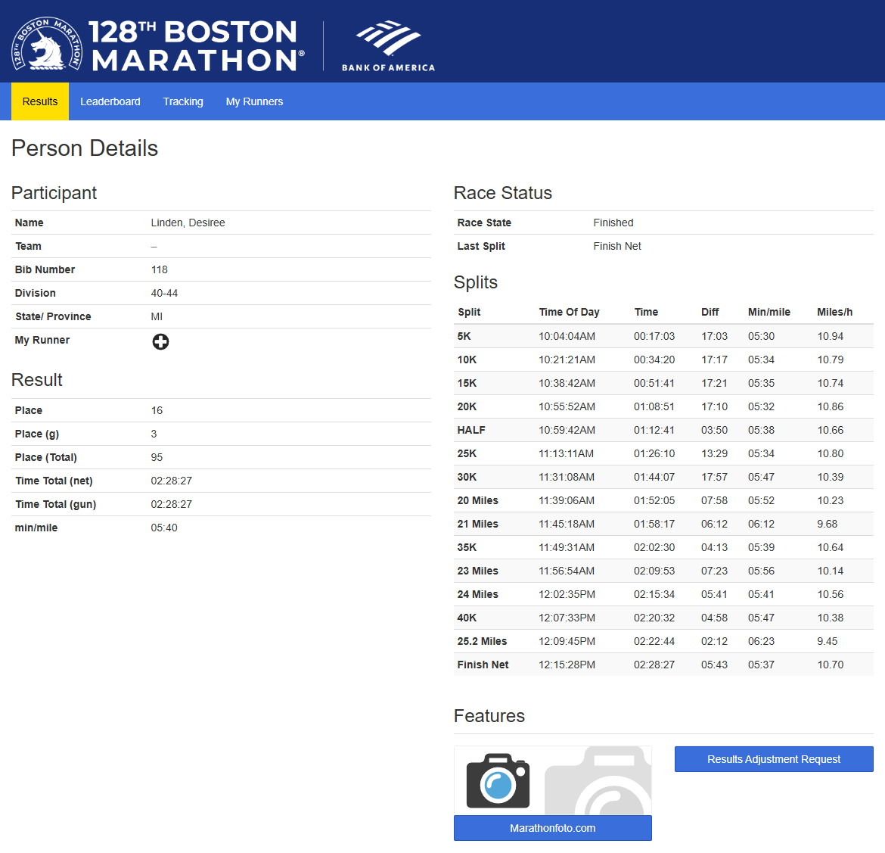
]

---
# Example 2: Boston 2024 Results


To start, read in the page's HTML.

```{r}
des_24 <- read_html("https://results.baa.org/2024/?content=detail&fpid=list&pid=list&idp=9TGHS6FF19F087&lang=EN_CAP&event=R&event_main_group=runner&search%5Bsex%5D=W&search%5Bage_class%5D=%25&search_event=R")
```
---
# Example 2: Boston 2024 Results

What do we see when we look at the page?

.font90[
```{r}
des_24
```
]

--

<br>


1. The page's head information (`<head>`)
  * Contains metadata about the page (not actually displayed)
--
  
1. The page's body contents (`<body>`) 
  * This is where all the stuff is


---
# Example 2: Boston 2024 Results

Look at the body's .hi-medgrn[child elements] with `html_children()`
  * all 10 elements nested under `body`


```{r, eval = T}
html_element(des_24, "body") %>% html_children()
```

---
# Example 2: Boston 2024 Results

Look at the body's .hi-medgrn[child elements] with `html_children()`
  * all 10 elements nested under `body`

This matches the .hi-medgrn[page source] (access with "Inspect")
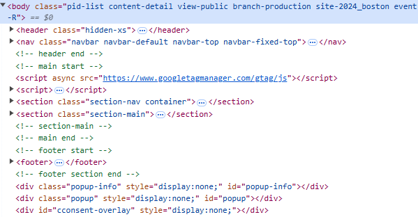


---
# Example 2: Boston 2024 Results

Let's start by grabbing all the information from the left half of the page.

<br>


Using SelectorGadget, identify the selector for the left-side contents.

.center[
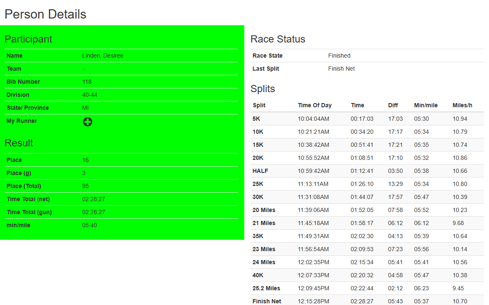
]


---
# Example 2: Boston 2024 Results

```{r}
des_24_l <- html_element(des_24, ".channel-left")
```

What's here?

--


```{r, width = "200px"}
des_24_l
```


Two elements:
  1. `detail-box box-general`: class of top half `div`
  2. `detail-box box-totals`: class of bottom half `div`


---
# Example 2: Boston 2024 Results

Start by grabbing the top half info with the full class:

```{r}
des_24_lu <- html_element(des_24_l, ".detail-box.box-general")
```

--

**Q:** did we need the first half (`detail-box`)?

```{r}
identical(des_24_lu,
          html_element(des_24_l, ".box-general")
          )
```
--

**A:** No! since there's only one `box-general` here we can refer to it directly.


---
# Elements vs. Element

We can see the difference with `html_element()` and `html_elements()`
--

.pull-left[
  * `html_element()`retrieves the .hi-medgrn[HTML nodes] directly
    * same length as the input
      * If a single node, just one thing gets returned
      * if a nodeset, returns a same-length vector

```{r}
html_element(des_24, ".detail-box")
```
]
--

.pull-right[
  * `html_elements()`retrieves the .hi-blue[nodeset itself] 
    * Contains all nodes that match
  
```{r}
html_elements(des_24, ".detail-box")
```
]

---
# Example 2: Boston 2024 Results

What does the left upper box contain?

```{r}
des_24_lu
```

What we grabbed *itself* contains two elements: 
1. An `h3` title, and 
1. a table (`table`)

---
# Example 2: Boston 2024 Results

Alternatively, to view .hi-purple[all elements AND all child elements], use the wildcard selector "*" in `html_elements()`
  * Ignores structure/nesting

.font90[
```{r}
html_elements(des_24_lu, "*")
```
]

---
# Grabbing Text

If we want to grab the text from the third-level heading `h3`, we can use
--

.pull-left[
1\. `html_text()`: retrieves the .hi-medgrn[raw, underlying text]

```{r}
html_elements(des_24_lu, "h3") %>% 
  html_text()
```
]
--

.pull-left[
2\. `html_text2()`: retrieves the text .hi-purple[as displayed in a browser]

```{r}
html_elements(des_24_lu, "h3") %>% 
  html_text2()
```
]

<br>

Here the difference is whether we keep the line break special character `\n` or not.

---
# Example 2: Boston 2024 Results

Grabb the (full) table with `html_table()`
  *  `html_table()` recognizes the tabular format of an HTML table, automatically converts to a tibble data frame (easiest option)

```{r}
part_tab <- des_24_lu %>%
  html_element("table.table-condensed") %>%
  html_table()

part_tab
```

---
# Example 2: Boston 2024 Results

.hi-slate[Challenge:] get the contents of the "Result" table (bottom-left)
.pull-left[
.hi-medgrn[Workflow:]
  * Start with `des_24_l`
  * Use `html_element()` (likely twice) to get the bottom table
  * Format as a data frame with `html_table()`
]
.pull-right.center[
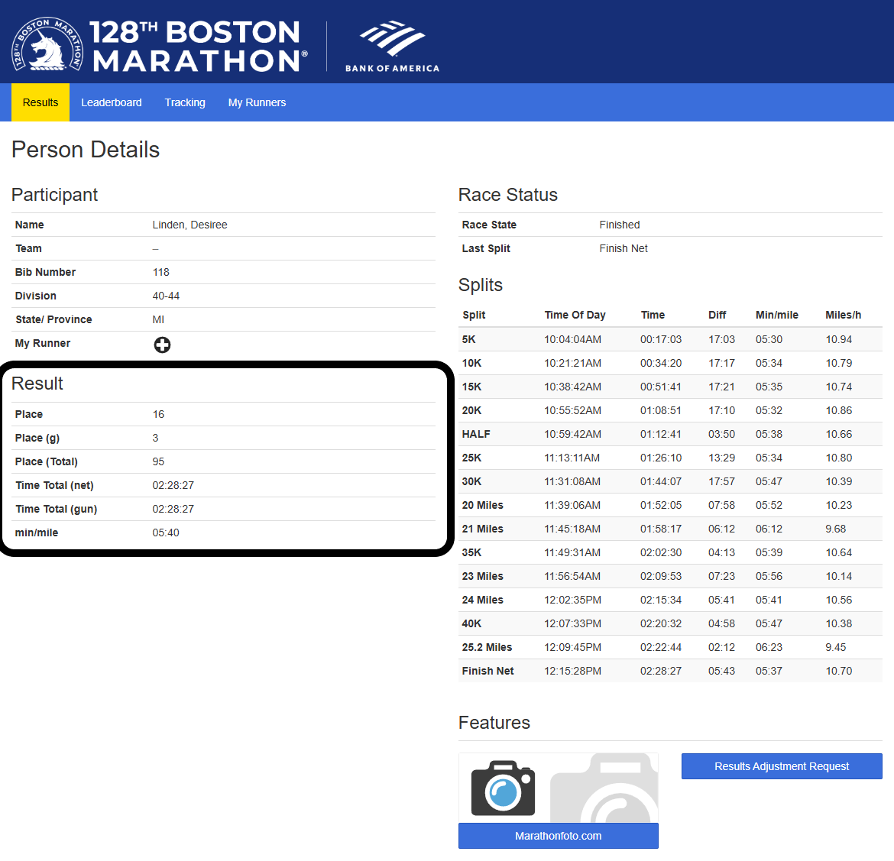
]

---
# Example 2: Boston 2024 Results

```{r}
res_tab <- des_24_l %>%
  html_element(".box-totals") %>%
  html_element(".table-condensed") %>%
  html_table()
head(res_tab)
```
---
# Example 2: Boston 2024 Results

Now that we have the left side stuff, let's grab the right side!

Conveniently, the selector follows the same naming convention

```{r}
des_24_r <- des_24 %>% html_element(".channel-right")
des_24_r
```

---
# Example 2: Boston 2024 Results

Here we can see that all the right-side info is *also* being stored in HTML tables. 

We *could* manually grab both the tables again... *or* we can take advantage of `html_elements()` retrieving all matches at once
  * Pull *all* `table` elements from `des_24`

--

```{r}
html_elements(des_24, ".table")
splits <- html_elements(des_24, ".table")[4] %>% html_table()
```
---
# Example 2: Boston 2024 Results

Finally, let's get the url links from the "Features" box buttons

.center[
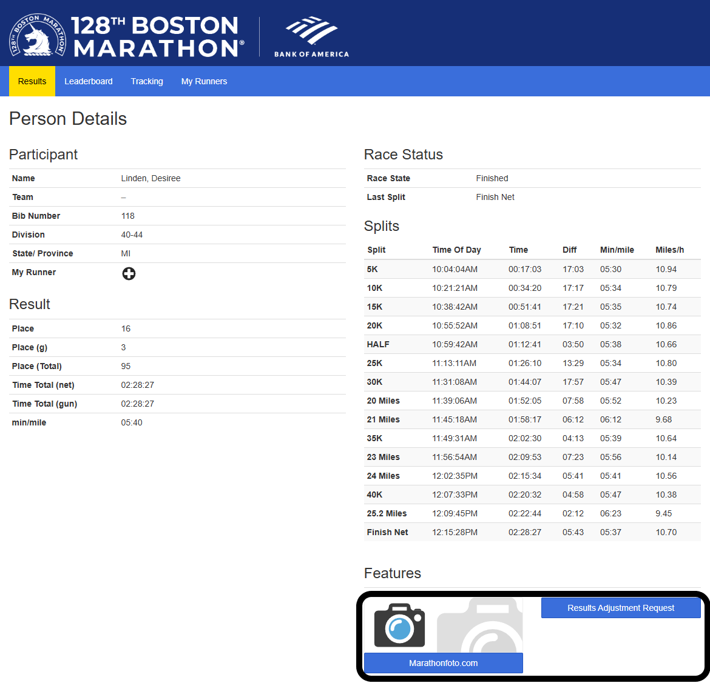
]

---
# Retrieving Links

.pull-left[
.hi-medgrn[Workflow:]
* Start with `des_24`
]
.pull-right[

<br>

```{r}
des_24 #<<
```
]

---
# Retrieving Links

.pull-left[
.hi-medgrn[Workflow:]
* Start with `des_24`
* Navigate to the right side (`.channel-right`)
]
.pull-right[

<br>
```{r}
des_24 %>%
  html_element(".channel-right") #<<
```
]

---
# Retrieving Links

.pull-left[
.hi-medgrn[Workflow:]
* Start with `des_24`
* Navigate to the right side (`.channel-right`)
* Navigate into the feature box (`.box-features`)
]
.pull-right[

<br>

```{r}
des_24 %>%
  html_element(".channel-right") %>%
  html_element(".box-features") #<<
```
]

---
# Retrieving Links

.pull-left[
.hi-medgrn[Workflow:]
* Start with `des_24`
* Navigate to the right side (`.channel-right`)
* Navigate into the feature box (`.box-features`)
* Retrieve the elements matching the button class (`a.btn.btn-primary.btn-block`)
]
.pull-right[

<br>

```{r}
des_24 %>%
  html_element(".channel-right") %>%
  html_element(".box-features") %>%
  html_elements("a.btn.btn-primary.btn-block") #<<
```
]

---
# Retrieving Links

.pull-left[
.hi-medgrn[Workflow:]
* Start with `des_24`
* Navigate to the right side (`.channel-right`)
* Navigate into the feature box (`.box-features`)
* Retrieve the elements matching the button class (`a.btn.btn-primary.btn-block`)
* Use `html_attr("href")` to retrieve all values of the `href` attributes
]
.pull-right[

<br>

```{r}
des_24 %>%
  html_element(".channel-right") %>%
  html_element(".box-features") %>%
  html_elements("a.btn.btn-primary.btn-block") %>%
  html_attr("href") #<<
```
]


---
# Structured v Unstructured

Here nearly everything was nicely formatted in HTML tables, which `html_table()` automatically converts into a structured format.

If what you want is unstructured/not together, you'll need to figure out the .hi-medgrn[individual selectors] and put them together in a .hi-red[custom data object]
```{r}
data.frame(
  athlete = "Des Linden",
  title = html_element(des_24, "a.navbar-brand") %>% html_element(".hidden-xs") %>% html_text2(),
  back_link = html_element(des_24, ".tt-help")  %>% html_attr("href") 

)

```

---
# Summary: Static Scraping

When scraping static web content rendered server-side:

  * Start by finding the relevant CSS selectors
  * Use the .hi-slate[rvest] package to read in the HTML document and parse it
    * Tabular workflow: `read_html(URL) %>% html_elements(CSS_Selectors) %>% html_table()`
    * Might need other functions depending on content type (e.g. `html_text/text2(), html_attr(), html_children()`)
    
---
class: inverse, middle
name: interact

# Interacting with Static Sites

---
# Interacting with Static Sites

While scraping a .hi-purple[known url] is pretty cool, we can do more than that.

--

We already saw one way to progress through a url chain, but we can .hi-blue[go deeper].

--


We can go 
--
.hi-medgrn[into].
--
.hi-medgrn[ the].
--
.hi-medgrn[ matrix].


---
# Interacting with Static Sites

Let's go back to the beginning with our Boston Marathon 2024 workflow.

Suppose rather than just Des' results, you wanted to

.pull-left[
  1. Navigate back to the main results search page
  1. Enter custom search term (i.e. specific age group/gender) and execute a search from the home page
  1. Retrieve all results from the first results page
  1. Navigate to the next page and repeat the process
  ]
  
  .pull-right[
  .center[

]
]

We can do this with .hi-slate[rvest].

---
# Interacting with Web Forms

To .hi-medgrn[interact with web forms], we'll use the below workflow:
  * Retrieve a target form with `html_form()`
  * Fill in the form's required elements with `html_form_set()`
  * Submit the form with `html_form_submit()`
  * Read the resulting url with `html_read()`.
  
  
Let's practice this by trying to retrieve the top 50 results for my age group (Men 18-39)

---
# Interacting with Web Forms 

Start by navigating to the [Boston Marathon Results Search](https://results.baa.org/2024/?pid=start&pidp=start) (the main search page).


---
# Interacting with Web Forms

Here, there are .hi-medgrn[multiple forms] with the same class (`form-horizontal`) but different names
  * `form_search_simple`: the top-left "Search"
  * `form_search_advanced`: the bottom-left "Advanced Search"
  * `form_lists_default`: the top-right "Results List" search

  
```{r}
bos_srch <- read_html("https://results.baa.org/2024/?pid=start&pidp=start")
html_form(bos_srch)
```
---
# Interacting with Web Forms

Use `html_form()` to extract the form we want (Results List):

To do this, we could use the `class[attr = \"value\"]` selector syntax to retrieve it as an element by name using our previous workflow

```{r}
res_form <- html_elements(bos_srch, "form[name = \"form_lists_default\"]") %>%
  html_form()
class(res_form)
```
But that nests the form within a list.

---
# Interacting with Web Forms

Use `html_form()` to extract the form we want (Results List):

Alternatively, just run `html_form()` on the main page and select the list item we want using list indexing
```{r}
html_form(bos_srch)[[3]]
```


---
# Interacting with Web Forms

Every web form has several different .hi-blue[fields] we'll need to fill or interact with

Here we've got:
  * 3 .hi-blue[hidden] fields that .hi-blue[we can't interact with]
  * 3 .hi-pink[select] fields that have .hi-pink[dropdown menus]
  * 2 .hi-medgrn[text subfields:] "search[sex]" and "search[age_class]" in the `event` dropdown
  * 1 .hi-purple[button] named "submit" we'd click when manually searching


---
# Filling Web Forms with *html_form_set()*

Let's set up our search by setting
  * Age Group to 19-39
  * 50 Results/Page

```{r}
search_set <- html_form_set(res_form[[1]],
                            "event" = "runner",
                           "search[sex]" = "M",
                             "search[age_class]" = "18-39", 
                            "num_results" = 50)
```
---
# Submitting Web Forms

Submitting the form and getting the response:
```{r}
resp <- html_form_submit(search_set) # submit the form
resp
```

---
# Web Form Response

Submitting the form gets us a `response` class object, containing some useful components, including the resulting url:

```{r}
resp$url
```

--

And we can read the response url as we usually do and navigate to the results element we want:


```{r}
# get the result url's html
res <- read_html(resp) %>% html_elements("div.col-sm-12.row-xs") %>% html_elements("li")
```
---
# Web Form Response

And looking at our results:

```{r}
res[2] %>% html_text()
```


Ahh dangit. Turns out that this page is .hi-purple[client-side] rendered
  * The page's content is .hi-purple[dynamically-generated] based on our search.
  

In order to scrape a client-side site, we're going to need more tools...  
  
  
---
class: inverse, middle
name: dynamic

# Scraping Dynamic Websites

---
# Dynamic Websites

.hi-medgrn[Dynamic client-side websites] are those are rendered dynamically and require .hi-medgrn[interaction] in order to obtain desired information.

While .hi-slate[rvest] can help us retrieve urls and element contents, it can't interact with .hi-purple[dynamically-generated or interactive] websites.<sup>1</sup>

--

To do that, we're going to take advantage of .hi-blue[browser automation] methods.

.footnote[<sup>1</sup> .hi-slate[rvest] has some functionality for live site interaction, but it is not as complete as the other options we'll see shortly.]

---
# Browser Automation

The main idea behind browser automation is this:

  > If a website requires pointing/clicking/typing to reveal the contents we want, why not have software "drive" a browser for us?
  
--

.pull-left[.hi-medgrn.center[Old Approach: RSelenium]
  * R bindings for the Selenium webdriver
  * Requires some additional software (i.e. Docker)
  * Additional steps to get it working with Mac OS X
]
--
.pull-right[
.hi-purple.center.underline[New Approach: selenider]
  * Uses .hi-slate[chromote] or Selenium automation tools to drive a Chrome browser
  * Syntax more closely matches tidyverse
  * Can't do some more complex things yet (i.e. click-and-hold, click a point)
]

---

# Application: EL Properties

Let's work through an example of an interactive workflow for .hi-medgrn[property characteristics in East Lansing].
  
Suppose you want to obtain property information for a known address within East Lansing. The city has a handy [interactive map viewer](https://ingham-equalization.rsgis.msu.edu/) for tax assessment info.

.center[
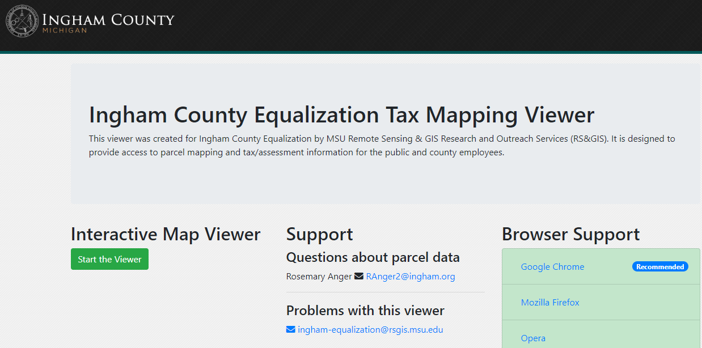]


---

# Application: EL Properties

Suppose we wanted to get information about the property at 549 Grove St. from the parcel map.

Doing this takes a couple steps:
  1. Launch the [Map Viewer](https://ingham-equalization.rsgis.msu.edu/Viewer)
  1. Click on "Search"
  1. Type address components (number and street name) into the search bar, hit Go
  1. Click on "Snap to Result" button to zoom in on the parcel
  1. Click on "Toggle Table" to show information

---

# Application: EL Properties

*Unfortunately*, this doesn't have the property details we are interested in.

.center[
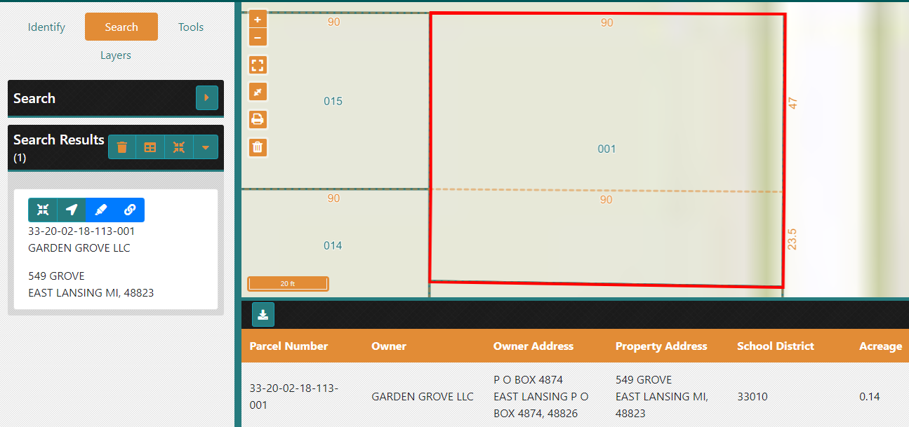]

---

# Application: EL Properties

*Fortunately*, there is a link to more information on a different site:


.center[
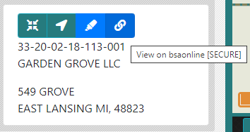]

---

# Application: EL Properties

Which *unfortunately* [requires verification](https://bsaonline.com/SiteSearch/SiteSearchDetails?SearchFocus=Assessing&SearchCategory=Parcel+Number&SearchText=33-20-02-18-113-001&uid=383&PageIndex=1&ReferenceKey=33-20-02-18-113-001&ReferenceType=0&SortBy=&SearchOrigin=0&RecordKey=1%3d33-20-02-18-113-001&RecordKeyType=1%3d0&sitetransition=true)

.center[
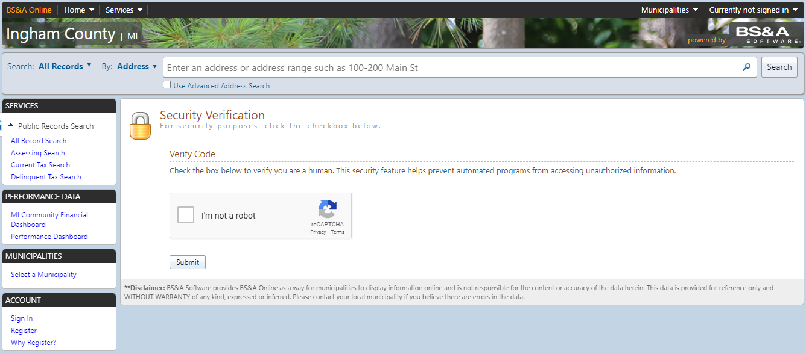]


---

# Application: EL Properties

Which *fortunately* has the characteristics we want once we get past this!


.center[
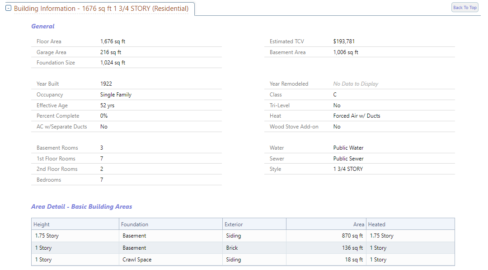]


---
# Workflow

Let's now work through these steps in the context of an automated browser workflow:
  1. Launch an automated browser session
  1. Navigate to the Map Viewer
  1. Search by street name + house number
  1. Retrieve displayed info
  1. Click detail link
  1. Pass verification test
  1. Scrape desired info

---
# 1. Launch Automated Session

First, we need to .hi-medgrn[initiate an automated browser session] with `selenider_session()`.<sup>2</sup>

```{r}
session <- selenider_session(
  browser = "chrome", # browser to drive
  session = "chromote", # set backend to chromote
  timeout = 10 # set timeout to 10 sec
)
```

--

We've now created a .hi-blue[local session]
  * Accessed anywhere in a given script/RMarkdown file
  * Closes automatically when the script/file finishes
  * If started within a function, closes when the function is done running

.footnote[<sup>2</sup> The full list of .hi-slate[selenider] functions can be found [here](https://ashbythorpe.github.io/selenider/reference/index.html)]
---
# View the Session

If you want to  .hi-blue[view the browser session], we need to add the argument

.center[`options = chromote_options(headless = F)`]

Which will open the session in your Chrome browser

```{r, eval = F}
session <- selenider_session(
  browser = "chrome", # browser to drive
  options = chromote_options(headless = F), # view the session
  "chromote", # set backend to chromote
  timeout = 10 # set timeout to 10 sec
)
```
---
# 2. Navigate to Map Viewer

Let's start by navigating to the main [Tax Mapping Viewer page](https://ingham-equalization.rsgis.msu.edu/) and launch the viewer

  * `open_url("URL")`
  
```{r}
  open_url("https://ingham-equalization.rsgis.msu.edu/")
```

---
# 2. Navigate to Map Viewer

Check that we ended up at the desired url:

```{r}
current_url()
```
---

#  Global Functions

Other actions that apply globally to the entire page:

| Function | Task |
| -------  | -----|
| `open_url()` | navigate to the indicated url |
| `current_url()` | get the current url |
| `get_page_source()` | get the page's HTML|
| `back(), forward()` | navigate forward or back|
| `reload(), refresh()` | reload the current page|
| `take_screenshot()` | take screenshot of current image|
| `execute_js_fn(), execute_js_expr()` | execute a JavaScript function |


---
# 2. Navigate to Map Viewer

Now we'll .hi-medgrn[click the "Start the Viewer" button] to launch the app.

.hi-slate[Involved Steps:] 
  * .hi-blue[Select] the button element by its CSS selector (`find_element()`)
  * .hi-medgrn[Scroll to] the button (`elem_scroll_to()`)
  * .hi-purple[Click] the button (`elem_click()`)
 
---
# Selection Functions

Some additional selection functions:

| Function | Task |
| -------  | -----|
| `s(), ss()` | select HTML elements (without specifying the session)|
| `find_element()` | find a single HTML child element (yields a `selenider-element` object) |
| `find_elements()` | find multiple HTML child elements (yields a `selenider-elements` object) |
| `elem_filter(), elem_find()` | extract a subset of HTML elements|

---
# Selection Functions

Hold up James, you're telling me that there are .hi-medgrn[six] different functions ?? Which should I be using?

--

.hi-blue[Thoughts:]

* `s()` is equivalent to `session %>% find_element()`
* `ss()` is equivalent to `session %>% find_elements()`
--

* `s()/find_element()` and `ss()/find_elements()` let you search by
  * CSS Selector (`css`)
  * XPath (`xpath`)
  * element ID (`id`), class (`class_name`), name (`name`)
--

* `elem_find()` and `elem_filter()` let us search by .hi-purple[conditions]
  * i.e. has certain text, has an attribute with a certain value, is visible, has a certain number of elements
  * We'll see helper functions that will help us out with this in a bit
  

---
# Element Properties

And functions for obtaining element properties

| Function | Task |
| -------  | -----|
| `elem_attr(), elem_attrs(), elem_value()` | Get attributes of an element|
| `elem_css_property()` | Get a CSS property of an element|
| `elem_name()` | Get the tag name of an element |
| `elem_size(), length(selenider-elements)` | get the number of elements in a collection|
| `elem_text()` | Get the text inside an element |
| `elem_equal()` | Test if two elements are equal|

---
# Actions

| Function | Task |
| -------  | -----|
| `elem_click(), elem_double_click(), elem_right_click()` | Click on an element|
| `elem_hover(), elem_focus` | Hover over an element|
| `elem_scroll_to()` | Scroll to an element |
| `elem_select()` |Select an HTML element|
| `elem_set_value(), elem__send_keys(), elem_clear_value()` | Set the value of an input |
| `elem_submit()` | Submit an element|
| `keys` | list of special keys |

---
# 2. Navigate to Map Viewer

.pull-left[
```{r}
session %>%
  find_element("a.btn.btn-success") %>% # select the button by CSS Selector
  elem_text()
```
]
.pull-right[
.center[
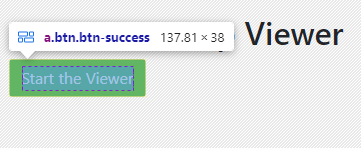]
]

```{r}
session %>%
  find_element("a.btn.btn-success") %>%
  elem_scroll_to() %>% # move the cursor to the button
  elem_click() # click the button
current_url()
```

---
# 3. Search by Address

We next want to select + click on the "Search" tab button.

To do this, we'll take advantage of .hi-medgrn[relative position] selector functions.

| Function | Task |
| -------  | -----|
| `elem_parent()` | select the element that contains the current element |
| `elem_ancestors()` | select every element containing the current element (children, grandchildren, etc.|
| `elem_siblings()` | select every element which has the same parent as the current element (e.g. list) |
| `elem_children()` | select every element connected to and directly below the current element |
| `elem_descendants()` | select every element that is contained by the current element (any type of ancestor)|


---
# 3. Search by Address

Select + click on the "Search" tab button.

.less-left[
.center[
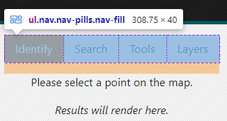]]

.more-right[
```{r}
session %>%
  find_element("nav.info-panel") %>% # get full nav panel
  elem_children()
```
]

---
# 3. Search by Address

Select + click on the "Search" tab button.

.less-left[
.center[
]]

.more-right[
```{r}
session %>%
  find_element("ul.nav.nav-pills.nav-fill") %>% # just the button menu
  elem_children()
```
]
---
# 3. Search by Address

We can also use .hi-medgrn[condition functions] to help with selection.
.small[
| Function | Task |
| -------  | -----|
| `has_text(), has_exact_text()` | has text that partially or fully matches |
| `has_attr(), attr_contains(), has_value()` | does the attribute match a value |
| `has_css_property()` | does an element's CSS property match a value (class, id, title, etc.)|
| `has_name()` | does an element have a tag name |
| `has_length(), has_size(), has_at_least()` | does a collection have a certain number of elements |
| `is_present(), is_in_dom(), is_absent()` | does an element exist|
| `is_visible(), is_displayed(), is_hidden(), is_invisible()` | is an element visible|
]
---
# 3. Search by Address

We can also use .hi-medgrn[condition functions] to help with selection.
  * `find_elements()` to yield a `selenider_element`
  * `elem_find()` to extract a specific subset of HTML elements
    * `has_text()` to grab the element with the text "Search"
  * `elem_click()` to click the selected button.
  
```{r}
session %>%
  find_element("ul.nav.nav-pills.nav-fill") %>% 
  find_elements("li.nav-item") %>%
  elem_find(has_text("Search")) %>%
  elem_click()
```

---
# 3. Search by Address

Checking to make sure we've activated the "Search" menu tab:

```{r}
session %>%
  find_element("ul.nav.nav-pills.nav-fill") %>% 
  elem_children()
```
See the `nav-link active` class on the second element with the "Search" text?

---
# 3. Search by Address

Now .hi-purple[enter text] into the desired fields


.less-left[
.center[
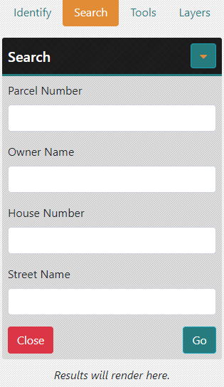]]

.more-right[
```{r}
# Find house number field
session %>%
  find_element("div.service-accord") %>%
  elem_children()
```
]


---
# 3. Search by Address

Now .hi-purple[enter text] into the desired fields


.less-left[
.center[
]]

.more-right[
```{r}
# Find house number field
session %>%
  find_element("div.__content") %>%
  elem_children()
```
]


---
# 3. Search by Address

Now .hi-purple[enter text] into the desired fields and click "Go"

.less-left[
.center[
]]

.more-right[
```{r}
# set house number
ss("div.service-input.form-group") %>%
  elem_find(has_text("House")) %>%
  find_element("input") %>% 
  elem_set_value("549") 

# set street name
ss("div.service-input.form-group") %>%
  elem_find(has_text("Street")) %>%
  find_element("input")  %>% 
  elem_set_value("Grove") 

# Click button
  ss("button.btn.btn-info") %>%
    elem_find(has_text("Go")) %>%
    elem_scroll_to() %>%
    elem_click()
```
]

---
# 4. Retrieve Displayed Info
.center[
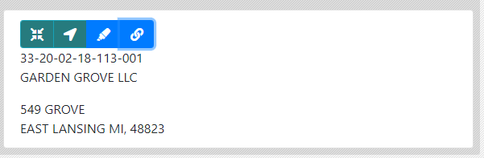]

```{r}
session %>%
  find_element("div.result-item") %>%
  read_html() %>%
  html_text2() %>%
  str_replace_all("\n\n", "\n") %>%
  str_split("\n")
```

---
# 5. Follow Detail Link

```{r}
s("a.btn.btn-primary") %>%
 elem_attr("href") %>%
 open_url()

current_url()
```
---
# 6. Pass Verification Test

Here's where things break down a bit. 

--

We can get our browser to click the "Verify" button
```{r, eval = F}
 s("#GetUserValidationInfo") %>%
     elem_scroll_to() %>%
     elem_click()
```
--

But then we get... the dreaded captcha

.center[
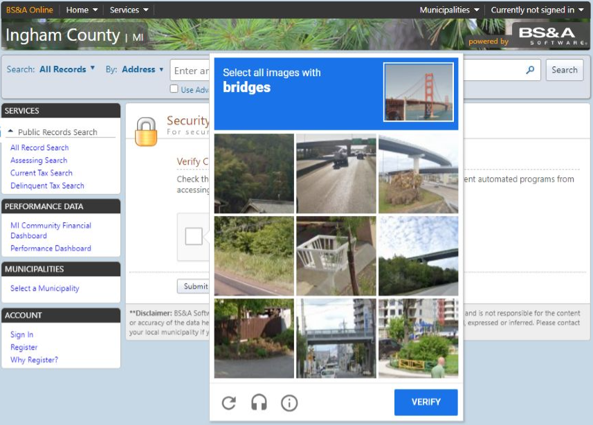]

---
# 6-7. Pass Verification Test + Scrape

While I have yet to figure out a way around one of these image recognition captchas, here's a .hi-medgrn[semi-automated workaround:]
  * Wait a set amount of time until an HTML element is present with `elem_expect()` and `is_present()`
    * i.e. element from the results page after the captcha
  * Manually complete the captcha (must be viewing the session!)
  * Proceed to scrape what's on the page
  
```{r, eval = F}
details <- ss("div.record-details-collapsible-box") %>%
  elem_find(has_text("Building Information")) %>%
  find_element("div.widthContainer table.detailTable") %>%
  elem_expect(is_present, timeout = 60) %>% # wait up to 60 seconds to manually complete the captcha
  read_html() %>%
  html_table() %>%
  as.data.frame()

details
```

---
# Back to Boston Marathon

Now that we've learned how to use dynamic scraping methods with .hi-slate[selenider], let's go back to our initial motivation: scraping [2024 Boston Marathon results](https://results.baa.org/2024/?pid=list&pidp=start)


---
# Back to Boston Marathon

.hi-medgrn[Workflow:]
* Start a .hi-slate[selenider] session (or use the currently-open one)
* Navigate to the [2024 Boston Marathon results search page](https://results.baa.org/2024/?pid=list&pidp=start)
* Select the "Result Lists" form (`form_lists_default`)
* Use the "Age Group" form to select the "18-39" option
* Use the "Results/Page" dropdown to select 100

---
# Back to Boston Marathon

First, navigate to the [2024 Boston Marathon results search page](https://results.baa.org/2024/?pid=list&pidp=start)
```{r}
open_url("https://results.baa.org/2024/?pid=start&pidp=start")
```

And select the form using the `form_lists_default` name:

```{r}
find_element(session, name = "form_lists_default")
```

---
# Back to Boston Marathon

Within the form, we want to interact with a `select` element. To do this, use `elem_select()` on the desired option
  * Here, I used XPath syntax for the "18-39" option.
  * SelectorGadget gives *another* XPath that works: `//*[@id="default-lists-age_class"]/option[2]`
  
.more-left.font90[
```{r}
find_element(session, name = "form_lists_default") %>%
  find_element(name = "search[age_class]") %>% # select the "Ag Group" dropdown
  find_element(xpath = "//*/option[@value = \"1\"]") %>%
  elem_select() 
```
]
.less-right[

]

---
# Back to Boston Marathon

Next, use the same approach with `elem_select()` to change the results per page option to 100
  * This time, using SelectorGadget's CSS selector!

.more-left.font90[
```{r}
find_element(session, name = "form_lists_default") %>%
  find_element(name = "num_results") %>% # select the "Ag Group" dropdown
  find_element("#default-num_results > option:nth-child(3)")%>%
  elem_select() 
```
]
.less-right[
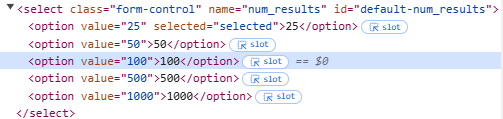
]


---
# Back to Boston Marathon

Finally, find and click the button!


.more-left.font90[
```{r}
find_element(session, name = "form_lists_default") %>%
  find_element(name = "submit") %>%
  elem_click()
```
]
.less-right[
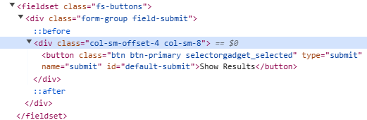
]

---
# Back to Boston Marathon

Our page has now been populated with the matching search results!

Retrieve the page's current HTML with `get_page_source()`, and then we can use .hi-slate[rvest] methods to retrieve the text we want.

```{r}
Sys.sleep(5)
res_page1 <- get_page_source() %>%
  html_elements("div.row") %>%
  html_elements("li.list-group-item.row") %>%
  html_text2()
head(res_page1)
```
---
# Back to Boston Marathon

**Challenge:** format the page 1 results as a dataframe, splitting into all 9 columns
  * Back to data wrangling/cleaning!
  * _hint:_ use `separate_wider_delim()`
  
  
---
# Back to Boston Marathon

**Challenge:** format the page 1 results as a dataframe, splitting into all 9 columns
  * Back to data wrangling/cleaning!
  * _hint:_ use `separate_wider_delim()`
  
---
# Back to Boston Marathon

**A:**

```{r}
page1_df <- data.frame(string = res_page1[2:length(res_page1)]) %>%
  separate_wider_delim(cols = string, delim = "\n",
                       names = c("place_overall", "place_gender", "place_division", "name", "team_dup", "team", "bib_dup", "bib", "half_dup", "half", "finish_net_dup", "finish_net", "finish_gun_dup", "finish_gun")) %>%
  dplyr::select(-ends_with("dup"))

head(page1_df)
```

---
# Scraping Dynamic/Interactive Websites

Methods for scraping dynamic or interactive websites opens up a huge range of possibilities.
  * Iterative process of 
    * Interact with the website and its elements
    * Extract element contents as with static sites
  * Interactive workflows are generally more complex, so worth thinking about tradeoff between just brute forcing vs. coding up a scraping routine
  
Things will also get exponentially easier once we get through our programming lecture, which will allow you to automate repeated scraping tasks   

---

# Table of Contents

1. [Prologue](#prologue)

2. [Scraping Static Websites](#static)

3. [Interacting with Static Websites](#interact)

4. [Scraping Dynamic Websites](#dynamic)


```{r gen_pdf, include = FALSE, cache = FALSE, eval = FALSE}
infile = list.files(pattern = 'Part2.html')
pagedown::chrome_print(input = infile, timeout = 200)
```